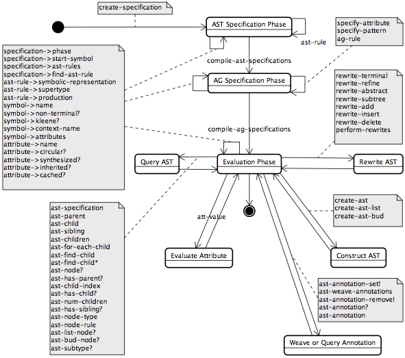

_[>> Title <<](title.md) [>> Synopsis <<](synopsis.md) [>> Contents <<](contents.md) [>> API Index <<](api-index.md)_
___

# Library Overview

## Architecture

To use _RACR_ within _Scheme_ programs, it must be imported via `(import (racr core))`. The imported library provides a set of functions for the specification of AST schemes, their attribution and the construction of respective ASTs, to query their information (e.g., for AST traversal or node type comparison), to evaluate their attributes and to rewrite and annotate them.

Every AST scheme and its attribution define a language -- they are a **_RACR_ specification**. Every _RACR_ specification can be compiled to construct the **_RACR_ language processor** it defines. Every _RACR_ AST is one word in evaluation by a certain _RACR_ language processor, i.e., a runtime snapshot of a word in compilation w.r.t. a certain _RACR_ specification. Thus, _Scheme_ programs using _RACR_ can specify arbitrary many _RACR_ specifications and for every _RACR_ specification arbitrary many ASTs (i.e., words in compilation) can be instantiated and evaluated. Thereby, every AST has its own **evaluation state**, such that incremental attribute evaluation can be automatically maintained in the presence of rewrites. Figure 2.1 summarises the architecture of _RACR_ applications. Note, that specification, compilation and evaluation are realised by ordinary _Scheme_ function applications embedded within a single _Scheme_ program, for which reason they are just-in-time and on demand.

**Figure 2.1:** Runtime structures/entities of _RACR_ Applications

The relationships between AST rules and attribute definitions and ASTs consisting of nodes and attribute instances are as used to. _RACR_ specifications consist of a set of **AST rules**, whereby for every AST rule arbitrary many **attribute definitions** can be specified. ASTs consist of arbitrary many **nodes** with associated **attribute instances**. Each node represents a context w.r.t. an AST rule and its respective attributes.

## Instantiation

Three different language specification and application phases are distinguished in _RACR_:
 * AST Specification Phase
 * AG Specification Phase
 * AST construction, query, evaluation, rewriting and annotation phase (Evaluation Phase)

The three phases must be processed in sequence. E.g., if a _Scheme_ program tries to construct an AST w.r.t. a _RACR_ specification before finishing its AST and AG specification phase, _RACR_ will abort with an exception of type `racr-exception` incorporating an appropriate error message. The respective tasks that can be performed in each of the three specification phases are:
 * **AST Specification Phase** Specification of AST schemes
 * **AG Specification Phase** Definition of attributes
 * **Evaluation Phase** One of the following actions:
   * Construction of ASTs
   * Querying AST information
   * Querying the values of attributes
   * Rewriting ASTs
   * Weaving and querying AST annotations

The AST query and attribute evaluation functions are not only used to interact with ASTs but also in attribute equations to query AST nodes and attributes local within the context of the respective equation.

Users can start the next specification phase by special compilation functions, which check the consistency of the specification, throw proper exceptions in case of errors and derive an optimised internal representation of the specified language (thus, compile the specification). The respective compilation functions are:
 * `compile-ast-specifications`: AST => AG specification phase
 * `compile-ag-specifications`: AG specification => Evaluation phase

To construct a new specification the `create-specification` function is used. Its application yields a new internal record representing a _RACR_ specification, i.e., a language. Such records are needed by any of the AST and AG specification functions to associate the specified AST rule or attribute with a certain language.

## API

The state chart of Figure 2.2 summarises the specification and AST and attribute query, rewrite and annotation API of _RACR_. The API functions of a certain specification phase are denoted by labels of edges originating from the respective phase. Transitions between different specification phases represent the compilation of specifications of the source phase, which finishes the respective phase such that now tasks of the destination phase can be performed.

**Figure 2.2:** _RACR_ Application Programming Interface

Remember, that _RACR_ maintains for every _RACR_ specification (i.e., specified language) its specification phase. Different _RACR_ specifications can coexist within the same _Scheme_ program and each can be in a different phase.
