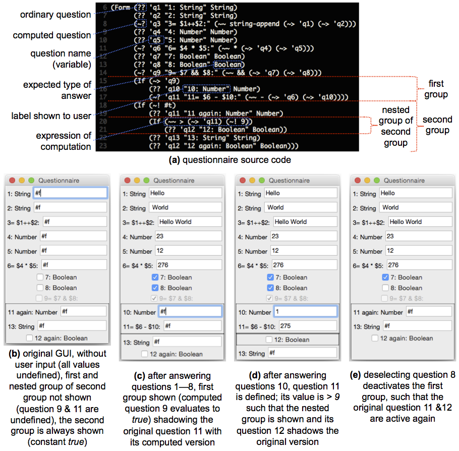
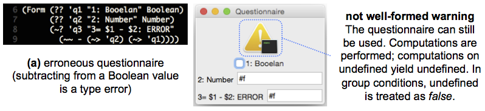

# Examples Overview

**Beware:** _RACR_ must be [installed](../documentation/requirements-and-installation.md) for the examples to work.

**Note:** The examples are ordered in increasing difficulty.

## Binary Numbers

**Difficult level:** Attribute grammar novice, _RACR_ novice
**New features:** Abstract syntax trees and attribution, synthesised and inherited attributes
**Size:** Very small
**Scheme library:** No, ordinary _Scheme_ top-level program

_RACR_ introduction based on Knuth's classical attribute grammar paper and its "binary to decimal numbers" example. For details cf.:

> Donald Ervin Knuth. "Semantics of Context-Free Languages".
> In: _Theory of Computing Systems_.
> Volume 2, Number 2. Springer, June 1968, pages 127-145.

**Objective:** Introduction to _RACR_.
 * Abstract syntax tree specifications: non-terminals, productions, inheritance
 * Attribute specifications: synthesised & inherited attributes
 * Abstract syntax tree & attribute query functions

## State Machines

**Difficult level:** Reference attribute grammar novice, _RACR_ novice
**New features:** Reference and circular attributes, attribute broadcasting, attribute inheritance
**Size:** Small
**Scheme library:** No, ordinary _Scheme_ top-level program
**Documentation:** [Implementation summary](state-machines/documentation/state-machines.md)

Simple finite state machine language implementation providing attributes to search for certain states by name, to compute the direct successors of a state, the states reachable from it (transitive closure) and if it is a final state. Also the well-formedness of state machines can be checked via attributes. A state machine is well-formed, if, and only if, all states (except the initial state) are reachable from the initial state and from every state (except final states) a final state is reachable.

The example shows, how reference attributes declaratively induce edges on abstract syntax trees, extending them to abstract syntax graphs. Such reference attribute induced edges form semantic overlay graphs and are typical for name and type analyses. In the example, reference attributes are used to 'transform' the abstract syntax tree, which was constructed by parsing a textual state machine representation, to the respective, actual, state machine diagram. The graph resulting from this name analysis is well-suited for further analyses, like the implemented state reachability.

**Objective:** Introduction to reference and circular attributes, their typical applications and advantages.
  * Reference attributes: Graph analyses (like a name analyses to lookup the incoming and outgoing transitions of states)
  * Circular attributes: Transitive closure analyses (like state reachability)

## _SLE 2015_: RAG-controlled rewriting motivation and overview

**Difficult level:** RAG-controlled rewriting novice, _RACR_ novice
**New features:** Rewrites
**Size:** Small
**Scheme library:** No, ordinary _Scheme_ top-level program
**Peer-reviewed:** Published at the _8th ACM SIGPLAN International Conference on Software Language Engineering_

This example summarises and motivates the essential features of _RACR_ by implementing a simple nested programming language, enriched with type coercion, superfluous cast optimisation and type refactoring. The example gives an overview of the basic concepts of RAG-controlled rewriting:
  * How reference attributes extend _abstract syntax trees_ to _abstract syntax graphs_
  * How _dynamic attribute dependencies_ extend abstract syntax graphs to _dynamic attribute dependency graphs_
  * The importance and benefits of dynamic dependencies for _incremental attribute evaluation_
  * How reference attribute grammar based analyses can be used to ease the development of _rewrite-based transformations_

**Objective:** Self-contained, easy and fast to understand introduction to RAG-controlled rewriting; overview of essential _RACR_ features.
 * Specification, query and rewrite functions
 * Abstract syntax graph memoization
 * Application of attribute-based analyses for transformations
 * Incremental evaluation

## Atomic Petri Nets

**Difficult level:** RAG-controlled rewriting novice, _RACR_ disciple
**New application:** RAG-controlled rewriting for incremental program execution
**Size:** Small
**Scheme library:** Yes

Implementation of a coloured, weighted Petri net interpreter that supports arbitrary input arc conditions and output computations. Reference attribute grammar based analyses are used to perform name, enabled and well-formedness analyses of Petri nets; rewrites are used to implement their actual execution semantics, i.e., the firing of enabled transitions.

The example demonstrates the reuse of attribute-based analyses to ease and control rewriting. The presented enabled analysis deduces all enabled transitions and their respective consumed tokens. Given this information, execution via rewriting is straight forward: as long as there are enabled transitions, select one, delete its consumed tokens and add the produced ones. During this loop, enabled analysis is automatically optimised by incremental attribute evaluation.

**Objective:** Introduction to RAG-controlled rewriting and dynamic, incremental attribute evaluation.
 * Reference attributes: Name, graph and well-formedness analyses (e.g., the enabled analysis of Petri net transitions)
 * Rewrites: AST represents a state, rewrites are state changes (e.g., rewrites that delete consumed and add produced tokens of fired transitions)
 * Incremental Evaluation: Attributes are only re-evaluated if they depend on information changed by rewrite applications (e.g., the enabled status of transitions is only re-evaluated if the last fired transition influenced it)

## _TTC 2015_: _fUML Activity Diagrams_

**Difficult level:** RAG-controlled rewriting disciple, _RACR_ experienced
**New concept:** Language reuse by means of cross-language higher-order attributes
**Size:** Small/Medium
**Scheme library:** Yes
**Peer-reviewed:** Published at the _8th Transformation Tool Contest_ as a solution of _The TTC 2015 Model Execution Case_

## _Language Workbench Challenges 2013 & 2014_: Questionnaires

**Difficult level:** RAG-controlled rewriting disciple, _RACR_ experienced
**New application:** RAG-controlled rewriting for interactive runtime models
**Size:** Small/Medium
**Scheme library:** Yes

Implementation of the Questionnaire Language, the competition scenario of the [Language Workbench Challenges 2013 and 2014](http://www.languageworkbenches.net). For a description of the scenario consult `./questionnaires/documentation/language-workbench-challenge-2013.pdf`. The questionnaires of the _RACR_ solution look as follows:

**Figure 1:** Correct example questionnaire and its rendering.

**Figure 2:** Incorrect example questionnaire and its rendering.

Questionnaires, as defined in the _Language Workbench Challenge_, consist of arbitrary many questions. Each question is typed and can be computed, in which case it does not ask users for a value but instead evaluates a given expression and shows the result. Questions can also be part of a group, which means they are only shown if their group condition is _true_. Groups can be nested. Nesting has no further meaning besides combining group conditions. The value of a question, whether computed or user-given, is only visible for succeeding expressions (declare before use). The same question is at most shown once. If it can be shown several times, only its first occurrence is active, i.e., shown to users and its value used in expressions. Questionnaires are statically typed and only well-formed if type correct. The value of unanswered questions is undefined. Computations on undefined yield undefined themselves. If a group condition is undefined, the group is not shown (i.e., the condition is treated to be _false_).

The _RACR_ solution is unique in several ways:
  * The abstract syntax graphs of questionnaires model both, the given and computed information _and_ their graphical representation.
  * The widgets of the GUI are computed by attributes. The actual rendering, i.e., showing and shadowing of questions and updating of computed results, is realised by attributes and rewrites respectively. In doing so, the rendering automatically becomes incremental, i.e., when drawing the GUI, the application will only re-render the GUI elements that changed since their last rendering (for example, if new answers change the value of computed questions or enable or disable groups).
  * Attributes clearly encapsulates all language concerns; a convenient model-view-controller solution is achieved without code mixing, doubling or unnecessary interdependencies. Thereby, the controller is automatically realised by _RACR's_ incremental evaluation.
  * Questionnaires are serialized and deserialized as symbolic-expressions, i.e., executable _Scheme_ programs. If executed, these programs construct the abstract syntax tree representing the respective questionnaire and its current answer state.

The solution uses [_Racket_](http://racket-lang.org) for its GUI implementation for which reason it only works with _Racket_.

**Objective:** Simple example showing the application of RAG-controlled rewriting for runtime models, in particular regarding incremental analyses.
 * Abstract syntax tree encodes real world state (model of real world: questions presented in a GUI to a user)
 * State changes via rewriting (model updates: user answers)
 * State reasoning and reaction on changes via attributes (model reasoning to derive real world actions: computation of the values of computed questions & re-rendering of GUI elements as necessary)

## Composed Petri Nets

**Difficult level:** RAG-controlled rewriting experienced, _RACR_ experienced
**New concept:** Language reuse and extension by specification inheritance and refinement
**Size:** Medium
**Scheme library:** Yes

Extension of the atomic Petri nets language with place fusion semantics, enabling the composition of nets by sharing common places. Composition is based on marking places as special in- and output-ports as presented by

> Wolfgang Reisig. "Simple Composition of Nets".
> In: _Applications and Theory of Petri Nets: 30th International Conference_.
> Volume 5605. Lecture Notes in Computer Science. Springer, June 2009, pages 23-42

A highlight of the example is the automatically optimised enabled analysis thanks to the incremental evaluation semantics of _RACR_. Compositions, executions and decompositions of nets can be arbitrarily intertwined whereas name, well-formedness, composition and enabled analyses are incrementally evaluated.

Objectives:
 * Extensive incremental evaluation scenario where rewrites are deduced using complex analyses
 * Systematic language extensions by refining existing analyses and introducing new ones

## SiPLE (Simple imperative Programming Language Example)

**Difficult level:** Reference attribute grammar experienced, Rewriting novice, _RACR_ experienced
**Size:** Medium
**Scheme library:** Yes

SiPLE is a simple imperative programming language. Its language concepts are:
  * Integer, real and Boolean arithmetics
  * Pointers (including pointers to procedures and pointers)
  * A block-structured name space and nested procedures
  * Lexically-scoped first-class functions (i.e., lexical closures)
  * `While` and `If` control-flow statements
  * Automatic integer to real type coercions (e.g., when assigning an integer value to a variable of type real or when adding an integer to a real value)
  * A save interpreter, that calmly terminates in the presence of errors
SiPLE is strongly typed, such that a static type analysis can be performed.
