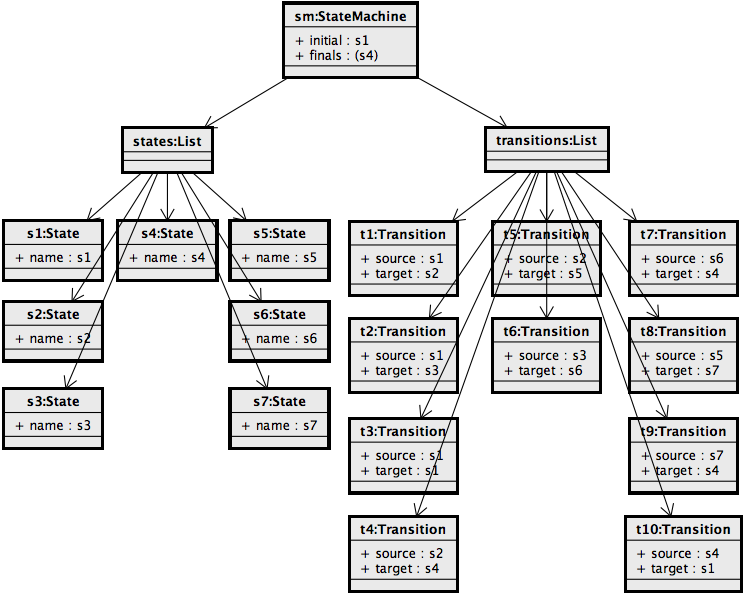
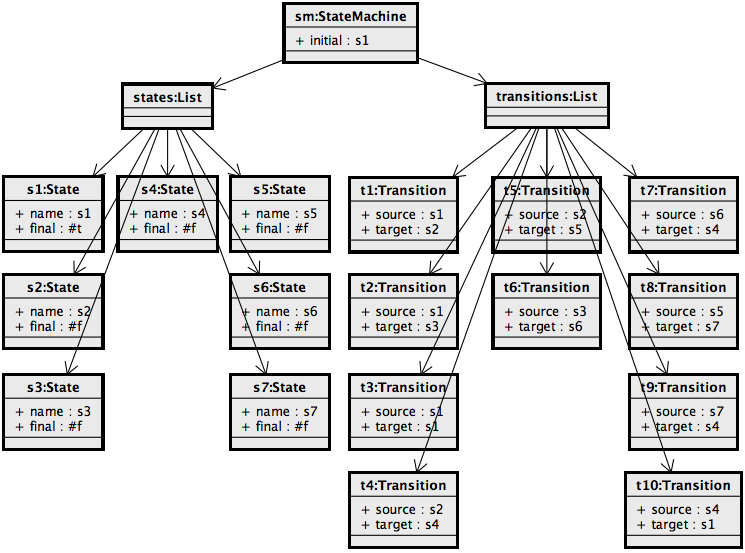

# Finite State Machines

The implementation of the finite state machines example consists of three parts:
  1. The specification of the actual finite state machines compiler (`with-specification` at the start of the example)
  1. A macro providing a user friendly syntax for the instantiation of finite state machines (`define-syntax state-machine:`)
  1. Some basic test cases defining finite state machines and querying their attributes (`define run-tests`).

In the following we focus on the `state-machine:` macro and the finite state machines compiler.

## `state-machine:` Macro

The `state-machine:` macro is used to provide a _Scheme_ syntax for the definition of finite state machines. The macro transforms symbolic-expressions encoding finite state machines into ASTs of the specified finite state machine compiler. For example consider the following finite state machine:



Its respective _Scheme_ program in the syntax provided by the macro is:

```
(state-machine:
 s1 ; Initial state
 (s4) ; List of final states
 ; Transitions:
 (s1 -> s2)
 (s1 -> s3)
 (s1 -> s1)
 (s2 -> s4)
 (s2 -> s5)
 (s3 -> s6)
 (s6 -> s4)
 (s5 -> s7)
 (s7 -> s4)
 (s4 -> s1))
```

This syntax is transformed by the macro into the following AST:



The AST consists of a root node with (1) a terminal naming the initial state of the machine, (2) a terminal which is a list containing the names of all final states, (3) a list of seven state nodes, each with a terminal representing its name and (4) a list of ten transition nodes, each having a source and target terminal naming its respective source and target state.

## Finite State Machines Compiler

A name analysis based on reference attributes is used to extend finite state machine ASTs to actual finite state machine graphs. First a parameterized reference attribute, that given a certain name searches through the list of states for an equally named state (`lookup-state` attribute), and another parameterized attribute, that applies a certain filter function on the list of transitions and returns only the transitions satisfying the filter (`filter-transitions` attribute), are specified. Based on these two attributes, the specification of the direct successors of some state `S` is straight forward: Just filter the transitions for the ones that have `S` as source and afterwards look up the respective target states of the filtered transitions (`successors` attribute). Thereon, the reachability of states can be specified using a circular reference attribute which just unifies the direct successors of a state with the successors of its direct successors (`reachable` attribute).

Finally, finite state machine well-formedness can be expressed by simple constraints on state reachability (`correct?` attribute). A finite state machine is well-formed, if, and only if, all states, except the initial state, are reachable from the inital state and from every state, except final states, a final state is reachable.
