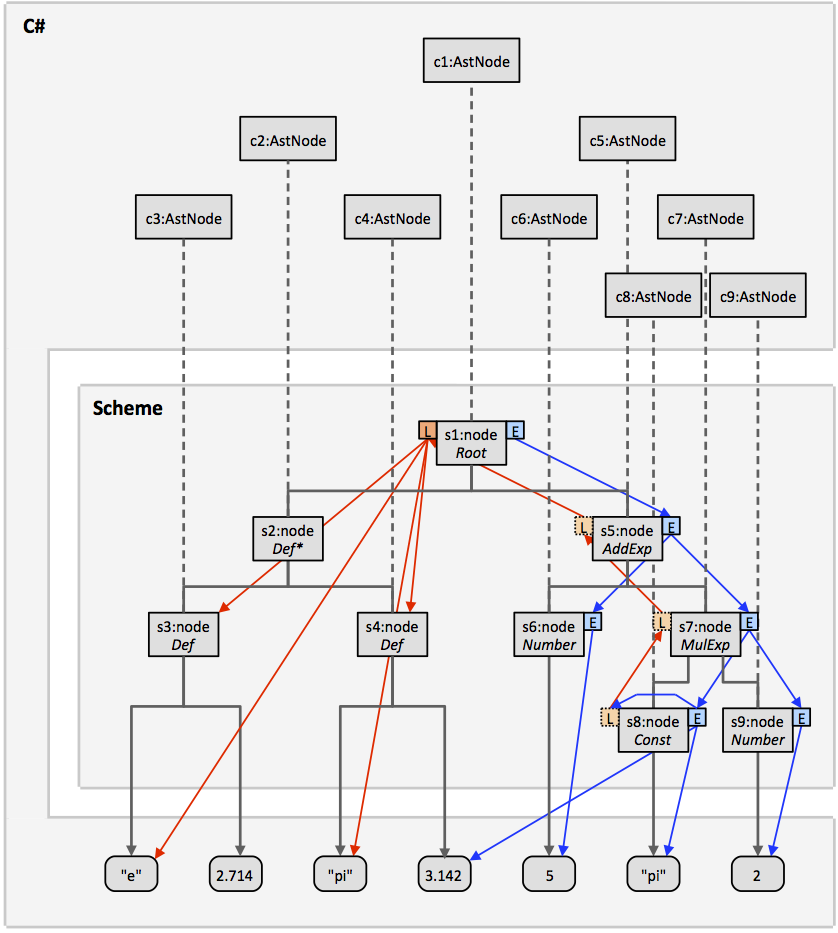
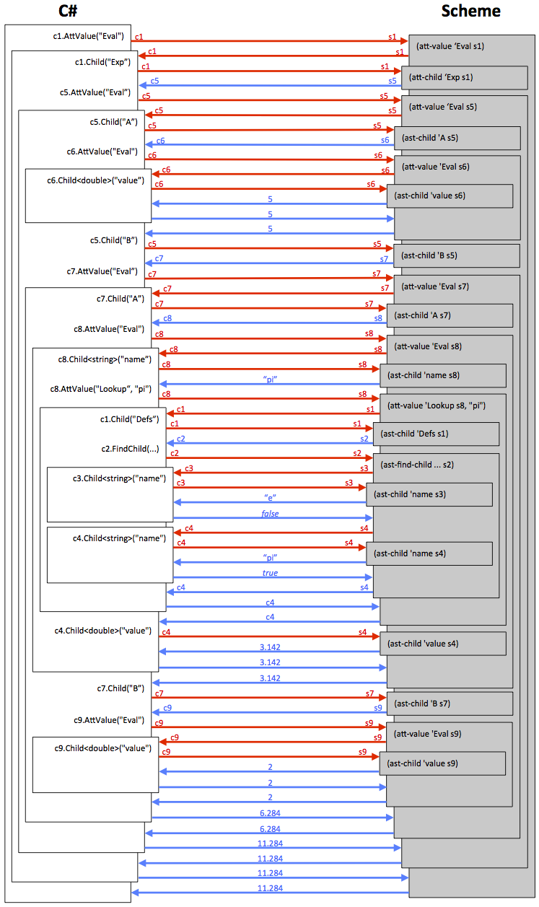

_[>> Title <<](title.md) [>> Preface <<](synopsis.md) [>> Contents <<](contents.md) [>> Bibliography <<](bibliography.md)_
___

# _RACR-NET_ Implementierung: Objektorientierte Schnittstelle

Dieses Kapitel beschäftigt sich mit der Verwirklichung einer objektorientierten _C#_-Schnittstelle für _RACR_: _RACR-NET_. Dabei sollen die in Kapitel 3.4.2 für verbesserungswürdig befundenen Probleme der prozeduralen Schnittstelle gelöst werden. Erreicht wird dies durch Refactoring der prozeduralen Schnittstelle. Die Idee hierbei ist, dass dessen Funktionalitäten entweder für _RACR_-Spezifikationen oder AST-Knoten definiert sind, sich also in zwei entsprechende Klassen partitionieren lassen (`RACR.Specification` und `RACR.AstNode`). Jede statische Methode der prozeduralen Schnittstelle (außer dem statischen `Racr`-Konstruktor) wird in eine Objektmethode einer der beiden Klassen umgeformt.

Die folgenden Unterkapitel stellen zunächst die resultierende objektorientierte Schnittstelle vor und demonstrieren deren Verwendung anhand eines Beispiels. Danach wird auf Details der Implementierung eingegangen. Eine Evaluation der Schnittstelle erfolgt in Kapitel 6.

## Überblick über die objektorientierte Schittstelle

Im Folgenden wird lediglich die Schnittstelle für Sprachspezifikationen und AST-Knoten eingeführt. Auf konkrete Details ihrer Implementierung wird in Kapitel 4.4 eingegangen.

### Spezifikationsschnittstelle

`RACR.Specification` ist die Hüllklasse für Sprach-Spezifikationen. Prozeduren, die auf Spezifikationen arbeiten, muss als erstes Argument stets eine `ast-specification` übergeben werden. Diese Prozeduren sollen nun über entsprechende Methoden der Klasse `Racr.Specification` aufgerufen werden. Deren Name und Signatur zeigt Quelltext 4.1. Die Klasse umfasst Methoden zur Spezifikation eines AST-Schemas (`AstRule`) und zur Attribuierung (`SpecifyAttribute`) sowie Fabrikmethoden zur Erzeugung von AST-Knoten (`CreateAst`, `CreateAstList` und `CreateAstBud`).

```
interface ISpecification {
	public void AstRule(string rule);
	public void CompileAstSpecifications(string start);
	public void CompileAgSpecifications();
	public void SpecifyAttribute(string name, string nonTerm,
						string context, bool cached, Delegate eq);
	public void SpecifyAttribute<R>(string name, string nonTerm,
						string context, bool cached, Func<AstNode,R> eq);
	public void SpecifyAttribute<R,T>(string name, string nonTerm,
						string context, bool cached, Func<AstNode,R,T> eq);
	public AstNode CreateAst(string nonTerm, params object[] children);
	public AstNode CreateAstList(params object[] children);
	public AstNode CreateAstBud();
}
```
**Listing 4.1:** Schnittstelle der Klasse `Racr.Specification`

Der entscheidende Unterschied zur prozeduralen Schnittstelle besteht darin, dass der erste Parameter einer Attributgleichungsfunktion mit dem konkreten Typ `Racr.AstNode` versehen ist (Zeilen 8 und 10). Zugriffe auf dem `node`-Record sollen auch innerhalb von Attributgleichungen über die Klasse `Racr.AstNode` geschehen. Auf diese Weise soll die Verwendung des vieldeutigen Typs `object` weitestgehend eingeschränkt werden. Allgemein ist der Verzicht von `object` für Kind-Knoten jedoch nicht möglich, da Terminale beliebigen Typs sein können, weswegen die Methoden `CreateAst` und `CreateAstList` genau wie in der prozeduralen Schnittstelle ein `object`-Array als Argument für die Kind-Knoten erwarten.

### Schnittstelle zum Abfragen von AST-Information

Mittels der Klasse `RACR.AstNode` soll dem Nutzer ein objektorientierter Zugriff auf AST-Knoten geboten werden. Quelltext 4.2 zeigt die Schnittstelle der Klasse. Methoden zur Graphersetzung und zum Setzen und Lesen von Annotationen wurden der Kürze halber ausgelassen.

```
interface IAstNode {
	public AstNode Parent();
	public AstNode Child(int index);		// Nichtterminal
	public AstNode Child(string name);		// Nichtterminal
	public AstNode Sibling(int index);		// Nichtterminal
	public AstNode Sibling(string name);	// Nichtterminal
	public T Child<T>(int index);			// Terminal
	public T Child<T>(string name);			// Terminal
	public T Sibling<T>(int index);			// Terminal
	public T Sibling<T>(string name);		// Terminal
	public bool IsNode();
	public bool HasParent();
	public int ChildIndex();
	public bool HasChild(string name);
	public int NumChildren();
	public bool HasSibling(string name);
	public string NodeType();
	public bool IsListNode();
	public bool IsBudNode();
	public virtual object[] Children(params Range[] bounds);
	public virtual void ForEachChild(Action<int,object> f,
									 params Range[] bounds);
	public virtual object FindChild(Func<int,object,bool> f,
									params Range[] bounds);
	public virtual object FindChildA(Func<int,object,object> f,
									 params Range[] bounds);
	public object AttValue(string attName, params object[] args);
	public T AttValue<T>(string attName, params object[] args);
	// ...
```
**Listing 4.2:** Schnittstelle der Klasse `Racr.AstNode`

In anderen Referenzattributgrammatik-Werkzeugen, wie JastAdd \[[Ekman2007](bibliography.md)\], wird für jeden Knotentyp einer Grammatik eine eigene Klasse mit maßgeschneiderten Methoden zum Zugriff auf Kind-Knoten und Attribute geboten. Anforderung **A2** in Kapitel 3.3 schließt den Einsatz derartiger Code-Generation jedoch aus, da hierfür die Grammatik schon zur Übersetzungszeit bekannt sein muss. Stattdessen wird für alle Knotentypen eine einheitliche, generische Schnittstelle bereitgestellt.

In _Scheme_ werden Prozeduren oft mit Präfixen versehen, um auf die Objekt-Typen hinzudeuten, auf die sie angewendet werden. Außerdem werden auf diese Weise Namenskollisionen vermieden. In _RACR_ ist dem Namen von Prozeduren, die zur Abfrage von AST-Information dienen, der Präfix `ast-` vorangestellt. Für die entsprechenden Methoden von `Racr.AstNode` wurde zur Verbesserung der Benutzerfreundlichkeit jedoch auf Präfixe verzichtet. Andernfalls wird Anforderung **A3** auch hier erfüllt.

Die Schnittstelle unterscheidet beim Zugriff auf Kind- und Geschwister-Knoten explizit zwischen Terminalen und Nichtterminalen. Die Methodengruppen `Child` und `Sibling` umfassen jeweils vier Methoden. Die nicht-generischen Ausführungen (Zeile 3 bis 6) beziehen sich auf Nichtterminale. Entsprechend ist der Rückgabewert jener Methoden vom Typ `Racr.AstNode`. Terminale können beliebigen Typs sein, weshalb die generischen Methoden (Zeilen 7 bis 10) einen Typ-Parameter erwarten, der den Typ des zu liefernden Terminals entsprechen muss. Somit wird die Verwendung des Typs `object` unterbunden. Die Typumwandlungen erfolgen innerhalb der Implementierung der Schnittstelle. Fehler bei der Angabe der Typ-Parameter führen dazu, dass währen der Programmlaufzeit Exceptions (`System.InvalidCastException`) ausgelöst werden.

Auch `AttValue` hat eine generische Umsetzung. Analog zu den Akzessoren für Terminale, spezifiziert der Typ-Parameter den Typ des Attributwertes.

Die vorgestellten Typ-parametrisierten Methoden können im Zusammenwirken mit sprachspezifischen zusätzlichen Hilfsfunktionen gekapselt werden, um den Zugriff auf Attribute sowie Kind- und Geschwister-Knoten zu vereinfachen und zu verkürzen. Außerdem wird dadurch eine konsistente Typisierung erreicht. Das folgende Kapitel demonstriert diesen Ansatz anhand eines Beispiels.

## Anwendungsbeispiel

Die gewünschte Arbeitsweise der _C#_-Schnittstelle für _RACR_ soll anhand eines Beispiels veranschaulicht werden. Quelltext 4.3 definiert die Grammatik einer Sprache für einfache arithmetische Ausdrücke. Sie beinhaltet eine Liste von Konstanten-Definitionen (`"Def"`) und einen beliebig tiefen AST, der den zu berechnenden Ausdruck (`"Exp"`) repräsentiert. Ausdrücke können Zahlen (`"Number"`), Konstanten (`"Const"`) sowie Additionen (`"AddExp"`) und Multiplikation (`"MulExp"`) weiterer Ausdrücke sein.

```
var spec = new Racr.Specification();
spec.AstRule("Root->Def*<Defs-Exp");
spec.AstRule("Def->name-value");
spec.AstRule("Exp->");
spec.AstRule("BinExp:Exp->Exp<A-Exp<B");
spec.AstRule("AddExp:BinExp->");
spec.AstRule("MulExp:BinExp->");
spec.AstRule("Number:Exp->value");
spec.AstRule("Const:Exp->name");
spec.CompileAstSpecifications("Root");
```
**Listing 4.3:** Spezifikation von AST-Regeln

Zuerst wird die Klasse `Racr.Specification` instanziiert. Auf dem erzeugten Objekt werden anschließend via `AstRule` die AST-Regeln der Sprache definiert. Die Spezifikationsphase des AST-Schemas wird durch einen Aufruf von `CompileAstSpecifications` abgeschlossen.

Diese Sprache soll um Attribute zur Berechnung von Ausdrücken ergänzt werden. Für gewöhnlich wird innerhalb einer Attributsfunktion auf AST-Knoten relativ zu dem Knoten, dessen Attribut ausgewertet werden soll, sowie auf weitere Attribute zugegriffen. Um diese Zugriffe zu vereinfachen, werden in _RACR_-Anwendungen typischerweise sprachspezifische Akzessor-Prozeduren definiert, welche statt den von _RACR_ bereitgestellten generischen Methoden genutzt werden können. Der Name solcher sprachspezifischen Akzessor-Prozeduren spiegelt das abzufragende Kind beziehungsweise Attribut wider. Die explizite Angabe eines Kind- oder Attributnamens, wie von den generischen Akzessor-Prozeduren RACRs benötigt, entfällt somit, was die Lesbarkeit, Wartbarkeit und Prägnanz von Sprachspezifikationen erhöht. In _C#_ erfüllen solche Hilfsfunktionen den zusätzlichen Zweck, die dynamischen Typumwandlungen bei Zugriffen auf Terminale oder Attribute auszulagern.

```
static class Accessors {
	// Kind-Knoten
	public static Racr.AstNode GetExp(this Racr.AstNode n) {
		return n.Child("Exp");
	}
	public static Racr.AstNode GetDefs(this Racr.AstNode n) {
		return n.Child("Defs");
	}
	public static Racr.AstNode GetA(this Racr.AstNode n) {
		return n.Child("A");
	}
	public static Racr.AstNode GetB(this Racr.AstNode n) {
		return n.Child("B");
	}
	public static double GetValue(this Racr.AstNode n) {
		return n.Child<double>("value");
	}
	public static string GetName(this Racr.AstNode n) {
		return n.Child<string>("name");
	}
	// Attribute
	public static double Eval(this Racr.AstNode n) {
		return n.AttValue<double>("Eval");
	}
	public static Racr.AstNode Lookup(this Racr.AstNode n, string name) {
		return n.AttValue<Racr.AstNode>("Lookup", name);
	}
}
```
**Listing 4.4:** Hilfsmethoden für den Zugriff auf Kind-Knoten und Attribute

Quelltext 4.4 definiert Extension-Methoden, die für die obige Beispielsprache als Akzessoren agieren. Die Typen der Terminale `"value"` und `"name"` sind explizit als `double` (Zeile 15) beziehungsweise `string` (Zeile 18) angegeben. Logischerweise müssen die gleichen Datentypen bei der Attributsspezifikation und AST-Konstruktion zum Einsatz kommen.

Die Methoden `Eval` und `Lookup` dienen zum Zugriff auf gleichnamige Attribute. Das Attribut `"Eval"` berechnet den Wert eines Ausdrucks. `"Lookup"` ist ein parametrisiertes Referenzattribut, das den zugehörigen Definitionsknoten einer Konstanten liefert.

```
spec.SpecifyAttribute("Eval", "Root", "*", true, (n) =>
	n.GetExp().Eval());

spec.SpecifyAttribute("Eval", "AddExp", "*", true, (n) =>
	n.GetA().Eval() + n.GetB().Eval());

spec.SpecifyAttribute("Eval", "MulExp", "*", true, (n) =>
	n.GetA().Eval() * n.GetB().Eval());

spec.SpecifyAttribute("Eval", "Number", "*", true, (n) =>
	n.GetValue());

spec.SpecifyAttribute("Eval", "Const", "*", true, (n) =>
	n.Lookup(n.GetName()).GetValue());

spec.SpecifyAttribute("Lookup", "Root", "*", true,
					  (Racr.AstNode n, string name) =>
	(Racr.AstNode) n.GetDefs().FindChild((i, d) =>
		((Racr.AstNode) d).GetName() == name));

spec.CompileAgSpecifications();
```
**Listing 4.5:** Attributsspezifikationen

Quelltext 4.5 zeigt die Spezifikation der genannten Attribute unter Verwendung der Akzessoren aus Quelltext 4.4. Das Attribut `"Eval"` wird für die Nichtterminale `"Root"`, `"AddExp"`, `"MulExp"`, `"Number"` und `"Const"` definiert. Interessant ist die Verwendung von `Lookup` auf dem `"Const"`-Knoten selbst (Zeile 14), obwohl das Attribut `"Lookup"` nur für den `"Root"`-Knoten definiert wird. _RACR_ implementiert Attribut-Broadcasting: Wenn ein Attribut für den Typ eines AST-Knotes, auf dem es aufgerufen wird, nicht definiert ist, wird der Attributsaufruf an den Eltern-Knoten weitergeleitet. Die Typsignatur der Attributsfunktion von `"Lookup"` entspricht der Signatur der entsprechenden Akzessor-Methode. Der zusätzliche Parameter hält den Namen der Konstanten. `FindChild` durchwandert linear die Liste von `"Def"`-Knoten und terminiert bei Namensübereinstimmung mit dem gefundenen Knoten. Bei erfolgloser Suche gibt die Methode `null` zurück.

```
var spec = new MySpec();
var defs = spec.CreateAstList(
				spec.CreateAst("Def", "e", 2.718),
				spec.CreateAst("Def", "pi", 3.142));
var exp = spec.CreateAst("AddExp",
			   spec.CreateAst("Number", 5.0),
			   spec.CreateAst("MulExp",
					spec.CreateAst("Const", "pi"),
					spec.CreateAst("Number", 2.0)));
var root = spec.CreateAst("Root", defs, exp);
Console.WriteLine("Eval: {0}", root.Eval());
```
**Listing 4.6:** AST-Konstruktion

In Quelltext 4.6 wird ein AST der Sprache unter Verwendung der Fabrikmethoden von `Racr.Specification` konstruiert. Der Ausdruck entspricht dabei `5 + (pi * 2)`. Das Ergebnis des Ausdrucks wird mittels `Eval` auf dem Wurzelknoten berechnet und anschließend ausgegeben (Zeile 11).

## Herausforderungen bei der Implementierung

Um das vorgestellte Verhalten der Schnittstelle zu realisieren, sind diverse programmiertechnische Hürden zu überwinden, die in diesem Kapitel nähergebracht werden sollen. Wichtig ist hierbei, dass die inkrementelle Auswertungssemantik RACRs für _C#_-Nutzer erhalten bleiben soll. Statt _RACR_ in _C#_ nachzubauen, soll deshalb vielmehr die existierende Implementierung genutzt werden. Das impliziert, dass die _RACR_-_Scheme_-Implementierung alle AST- und Attributdaten hält und Zugriffe auf diese protokolliert, um einen dynamischen Abhängigkeitsgraphen zur inkrementellen Auswertung aufzubauen. Jeder Zugriff von _C#_ auf AST- und Attributdaten muss entsprechend auf _RACR_ abgebildet werden. Andererseits sollen _C#_ Nutzer mit der _Scheme_-Implementierung nicht in Berührung kommen, das heißt, nur mit nativen _C#_-Objekten arbeiten.

Um die Konsequenzen dieser Anforderungen bezüglich der Implementierung der Schnittstelle zu erläutern, soll auf das Anwendungsbeispiel aus Kapitel 4.2 Bezug genommen werden. Abbildung 4.1 stellt die dort angelegten Objekte des ASTs und deren Beziehungen zueinander dar. Die schwarzen, durchgezogenen Linien und Pfeile repräsentieren die von _RACR_ bei der AST-Konstruktion erzeugen Assoziationen der `node`-Records zueinander beziehungsweise zu Terminalen. Die bijektiven Assoziationen zwischen einer `Racr.AstNode`-Instanz und dem zugehörigen `node`-Record sind als gestrichelte Linien dargestellt. Die kleinen Quadrate repräsentieren die Attribute `'Eval` (E) und `'Lookup` (L). Die blauen beziehungsweise roten Pfeile kennzeichnen deren Abhängigkeiten auf weitere Attribute und Kind-Knoten. Der resultierende Graph wird von _RACR_ zur inkrementellen Auswertung aufgebaut.



**Abbildung 4.1:** Beziehungen zwischen Adapter-Objekten und `node`-Records im AST

Entscheidend ist, dass `Racr.AstNode`-Instanzen keine Aggregationen zueinander besitzen. Sie fungieren lediglich als Proxy für die `node`-Objekte. Die eigentlichen Daten werden von _RACR_ in _Scheme_ gehalten. Jede AST- und Attributabfrage erfordert deshalb mehrfache Kontextwechsel zwischen _C#_ und _Scheme_. Während der Attributsauswertung registriert _RACR_ diese Abfragen und baut zur Realisierung der inkrementellen Auswertung einen dynamischen Abhängigkeitsgraphen für das jeweilige Attribut auf.

Abbildung 4.2 veranschaulicht die zeitliche Abfolge von Methodenaufrufen der objektorientierten Schnittstelle (links) und parallel dazu die Aufrufe der _Scheme_-Prozeduren von _RACR_ (rechts), die bei der Auswertung des Attributs `"Eval"` auf dem Wurzelknoten ausgelöst werden. Rote Pfeile repräsentieren die Kontextwechsel bei Funktionsaufrufen. Für terminierende Funktionen sind die Kontextwechsel als blaue Pfeile dargestellt. Außerdem kennzeichnen Pfeile den Datenfluss von AST-Knoten, wobei zwischen Nichtterminalen und Terminalen unterschieden wird. Für die Fälle, wo Nichtterminale übergeben werden, sind die Pfeile mit dem Namen der `Racr.AstNode`-Instanz und des `node`-Records aus Abbildung 4.1 beschriftet.



**Abbildung 4.2:** Zeitliche Abfolge von API-Aufrufen

Der Aufruf von `AttValue` auf der `Racr.AstNode`-Instanz `c1` soll an _RACR_ weitergeleitet werden, indem für den zugehörigen `node`-Record die Prozedur `att-value` aufgerufen wird. Da die Attributcaches noch leer sind, muss die Attributgleichung für das Attribut `'Eval` und dem Knotentyp `'Root` ausgewertet werden. _RACR_ ruft die zuvor via `specify-attribute` angegebene Prozedur mit `s1` als Argument auf. Diese Prozedur ist ein `Callable`-Objekt, in welchem das `Delegate`-Objekt von Quelltext 4.5 (Zeile 2) gekapselt werden muss. Der Aufruf von `Call` mit einem `node`-Record als Argument muss in dem Aufruf des Delegaten mit der entsprechenden `Racr.AstNode`-Instanz als Argument resultieren. Innerhalb des Delegaten wird auf `c1` die Methode `Child` aufgerufen, wo für den zugehörigen `node`-Record die Prozedur `ast-child` aufgerufen wird. Diese gibt den Record `s5` zurück. Der ursprüngliche `Child`-Aufruf muss diesen Record auf seine entsprechende `Racr.AstNode`-Instanz `c5` abbilden. Es ist nicht hinreichend, wenn `Child` einfach den `node`-Record zurückgäbe, da dies Anforderung **A5** verletzten würde. Die Wechsel zwischen _C#_ und _Scheme_ setzt sich fort, bis der Ausdruck schließlich berechnet ist.

Es geht hervor, dass ein ständiger Kontextwechsel zwischen _C#_ und _Scheme_ besteht. Zur Realisierung der Kontextwechsel von _C#_ zu _Scheme_ bedarf es einer Abbildung von `Racr.AstNode`-Instanz auf `node`-Record. Das gleiche gilt entsprechend umgekehrt für Kontextwechsel von _Scheme_ zu _C#_. Methoden, die diese Abbildungen ausführen, müssen vorzugsweise leichtgewichtige Implementierungen haben, da sie notwendigerweise häufig aufgerufen werden. Im Wesentlichen ergeben sich also die drei folgenden Probleme:

 * **Abbildung zwischen `Racr.AstNode` und `node`-Record:** Es muss die Möglichkeit geschaffen werden, zwischen der _Scheme_- und der _C#_-Identität eines AST-Knotens zu wechseln. Diese Abbildung muss in allen Methoden, die auf `Racr.AstNode`-Instanzen arbeiten, zum Tragen kommen.
 * **Unterscheidung bei Kind-Knoten zwischen Terminalen und Nichtterminalen:** In einigen Methoden, die uniform auf Terminalen wie Nichtterminalen angewendet werden, darf die besagte Abbildung nur bedingt eingesetzt werden, da in _RACR_ Terminale als ungekapselte Wert-Objekte gehandhabt werden.
 * **Wrapping der Attributsfunktionen:** Der erste Parameter einer Attributsfunktion ist der AST-Knoten, dessen Attribut ausgewertet werden soll. Aus der Sicht des _C#_-Nutzers handelt es sich um eine `Racr.AstNode`-Instanz. _RACR_ übergibt zur Attributauswertung jedoch keine `Racr.AstNode`-Instanz, sondern den Handler des `node`-Records an das `Callable`-Objekt. Die Delegaten der Attributsgleichung müssen daher in einer Methode gekapselt werden, welche den `node`-Record auf dessen entsprechende `Racr.AstNode`-Instanz abbildet.

Die Lösung dieser Probleme ist Gegenstand des folgenden Kapitels.

## Implementierung

In diesem Kapitel werden die Lösungen der in Kapitel 4.3 angeführten Probleme der Implementierung präsentiert.

### Brücke zwischen _C#_- und _Scheme_-Objekten

Instanzen von `Racr.Specification` und `Racr.AstNode` müssen notwendigerweise den Handler des jeweiligen _Scheme_-Records halten, um bei Methodenaufrufen diesen an die zugehörige _Scheme_-Prozedur weiterleiten zu können. Im Konstruktor von `Racr.Specification` wird via `createSpecification.Call` ein neuer `ast-spezifikation`-Record angelegt, dessen Referenz in einem privaten Feld der Klasse, `internal object` `handler`, gespeichert wird. Alle weiteren Methoden leiten analog zum prozeduralen Ansatz die erhaltenen Daten an Aufrufe der zugehörigen `Callable`-Objekte weiter, jedoch unter der Benutzung von `handler` als erstes Argument.

Gleichsam verhält es sich mit der Klasse `Racr.AstNode`. Die Abbildung von einer `Racr.AstNode`-Instanz auf deren zugehörigen `node`-Record ist schlicht mit dem Zugriff auf `handler` realisiert. Wie der Abbildung 4.2 zu entnehmen, ist jedoch eine unidirektionale Abbildung von `Racr.AstNode`-Instanzen auf `node`-Records nicht ausreichend. Eine Abbildung von `node`-Record auf `Racr.AstNode`-Instanz ist außerdem von Nöten. Dazu wird der Record um ein Feld ergänzt, das eine Referenz auf die Instanz hält.

```
(define-record-type node
  (fields
   (mutable evaluator-state)
   (mutable ast-rule)
   (mutable parent)
   (mutable children)
   (mutable attributes)
   (mutable cache-influences)
   (mutable annotations)
   (mutable csh-instance))      ; das neue Feld
  (opaque #t)(sealed #t)
  (protocol
   (lambda (new)
     (lambda (ast-rule parent children)
       (new #f ast-rule parent children
            (list) (list) (list)
            #f)))))             ; und dessen Initialwert
```
**Listing 4.7:** Angepasste Definition des `node`-Records

Quelltext 4.7 zeigt die angepasste Definition des `node`-Records in `racr/core.sls`. Auf Zeile 10 wird der Record um das Feld `csh-instance` erweitert. Im Record-Konstruktor wird dieses vorerst auf `#f` initialisiert. Des Weiteren müssen die Prozeduren zum Setzen (`node-csh-instance-set!`) und Lesen (`node-csh-instance`) des Felds aus der _Scheme_-Bibliothek exportiert werden und im statischen Konstruktor von `Racr` entsprechende `Callable`-Objekte initialisiert werden.

Nach der Erzeugung des `node`-Records im Konstruktor von `Racr.AstNode` muss die `this`-Referenz in `csh-instance` gespeichert werden. Die Hilfsfunktion `GetNode` extrahiert die Referenz von dem Handler.

```
private static AstNode GetNode(object ast) {
	return nodeCshInstance.Call(ast) as AstNode;
}
```

Mittels `GetNode` und dem Zugriff auf `handler` ist somit eine bidirektionale Abbildung zwischen `node`-Record und `Racr.AstNode` geschaffen.

### Berücksichtigung von Terminalen

Aufgrund der dynamischen Typisierung _Schemes_ bietet _RACR_ dem Nutzer eine generische Schnittstelle zum Zugriff auf Kinder- und Geschwister-Knoten – sowohl Terminale als auch Nichtterminale. In Kapitel 4.1.2 wurde gezeigt, dass im Gegensatz dazu der Klasse `Racr.AstNode` für den Zugriff auf Kind- und Geschwister-Knoten für Terminale und Nichtterminale jeweils unterschiedliche Methoden bereitgestellt werden: Methoden für den Zugriff auf Terminale erwarten einen zusätzlichen Typ-Parameter. Aus der Typsignatur einiger Methoden ist jedoch nicht ablesbar, ob es sich bei den übergebenen oder zu liefernden Knoten um Terminale oder Nichtterminale handelt. Nutzer müssen sich an die Grammatik der Spezifikation halten und die korrekten Akzessoren, mit gegebenenfalls passenden Typ-Parameter, nutzen.

Auch in der Implementierung der Schnittstelle muss innerhalb dieser Methoden bei Kind-Knoten zwischen Nichtterminalen und Terminalen unterschieden werden können, um entsprechend die Abbildungsfunktionen einzusetzen beziehungsweise davon abzusehen, da die Abbildung nur bei Nichtterminalen zum Tragen kommen darf. Dies betrifft folgende Methoden von `Racr.AstNode`: den Konstruktor, `Children`, `ForEachChild`, `FindChild`, `FindChildA`, `RewriteRefine` und `RewriteAbstract`. Diese Methoden realisieren die _RACR_-Prozeduren `ast-children`, `ast-for-each-child`, `ast-find-child`, `ast-find-child*`, `rewrite-refine` und `rewrite-abstract`. _RACR_ bietet eine Reihe undokumentierter Prozeduren zur Abfrage von Meta-Information bezüglich der AST-Schemas und Attribuierung für Spezifikationen eines ASTs. Folgende sind für den vorgestellten Zweck erforderlich:

 * `(specification->find-ast-rule spec non-term)` liefert die einem Nichtterminal zugehörige AST-Regel.
 * `(ast-rule->production rule)` liefert eine Liste mit den Produktionssymbolen einer AST-Regel.
 * `(symbol->non-terminal? symbol)` bestimmt, ob ein Symbol ein Nichtterminal ist.

Die Objekte für AST-Regeln und Symbole sind _RACR_-interne _Scheme_-Records. Mittels dieser Prozeduren wird im Konstruktor von `Racr.AstNode` für jeden Kind-Knoten bestimmt, ob er ein Nichtterminal ist. Diese Information wird aus Gründen der Effizienz direkt in der Klassen-Instanz gespeichert, um gegebenenfalls wiederverwendet zu werden.

```
public class AstNode {
	internal object handler;
	private bool[] ntChilren;
	public AstNode(Specification spec, string nonTerm,
				   params object[] children)
	{
		var nt = SymbolTable.StringToObject(nonTerm);
		var rule = specificationFindAstRule.Call(spec.handler, nt);
		var symbols = astRuleProduction.Call(rule) as Cons;
		ntChilren = new bool[children.Length];
		Cons list = null;
		Cons marker = null;
		for (int i = 0; i < children.Length; i++) {
			symbols = symbols.cdr as Cons;
			ntChilren[i] = symbolIsNonTerminal.Call<bool>(symbols.car);
			var child = ntChilren[i] ? (children[i] as AstNode).handler
									 : children[i];
			var cons = new Cons(child);
			if (list == null) list = marker = cons;
			else {
				marker.cdr = cons;
				marker = cons;
			}
		}
		handler = createAst.Call(spec.handler, nt, list);
		nodeCshInstanceSet.Call(handler, this);
	}
```
**Listing 4.8:** Initialisierungen im Konstruktor von `Racr.AstNode`

Quelltext 4.8 zeigt diesen Vorgang. Der Konstruktor enthält eine `for`-Schleife, die das übergebene Kind-Knoten-Array traversiert. Parallel wird die _Scheme_-Liste der Produktionssymbole durchwandert und die Information, ob ein Kind ein Nichtterminal ist, in `ntChildren` gespeichert (Zeile 15). Zusätzlich wird eine _Scheme_-Liste zur Weitergabe der Knote an `create-ast` konstruiert: Für Nichtterminal-Kinder wird aus der `Racr.AstNode`-Instanz der Handler auf den `node`-Record extrahiert (Zeile 16). Terminale werden direkt übergeben (Zeile 17). Interessant sind auch Zeilen 25 und 26, in denen `handler` beziehungsweise `csh-instance` gesetzt werden, wie in Kapitel 4.4.1 beschrieben.

In der Implementierung der übrigen, oben genannten Methoden, kann zur Unterscheidung von Terminalen und Nichtterminalen für den `n`-ten Kind-Knoten das entsprechende Element in `ntChildren` konsultiert werden.

### Wrapping der Attributsfunktionen

Attributsfunktionen werden in Form von Delegaten an die Methode `SpecifyAttribute` der Klasse `Racr.Specification` übergeben. Quelltext 4.9 zeigt eine naive Implementierung, in welcher analog zur Implementierung der prozeduralen Schnittstelle auf dem `Delegate`-Objekt _IronSchemes_ die Extension-Methode `ToSchemeProcedure` aufgerufen wird um ein `Callable`-Objekt zu erzeugen, das anschließend an den Aufruf der _Scheme_-Prozedur `specify-attribute` übergeben wird.

```
public void SpecifyAttribute(string name, string nonTerm, string context,
							 bool cached, Delegate equation)
{
	specifyAttribute.Call(
		handler,
		SymbolTable.StringToObject(name),
		SymbolTable.StringToObject(nonTerm),
		SymbolTable.StringToObject(context),
		cached,
		equation.ToSchemeProzedure(),
		false);
}
```
**Listing 4.9:** Naive Implementierung von `SpecifyAttribute`

Wie in Kapitel 4.4.1 vorgestellt, soll der erste Parameter einer Attributsfunktion vom Typ `Racr.AstNode` sein. Der Attributauswerter RACRs (die Prozedur `att-value`) erwartet jedoch Attributsfunktionen, deren erstes Argument ein _RACR_ `node`-Record ist — der AST Knoten mit welchem die auszuwertende Attributsinstanz assoziiert ist. Die Auswertung einer in _C#_ definierten Attributsfunktionn löst demnach einen Laufzeitfehler aus, da innerhalb des `Callable` der Versuch, den `node`-Record des AST-Knoten in eine `Racr.AstNode`-Instanz umzuwandeln scheitert. Auf dem `Delegate`-Objekt, das die Attributsgeichung hält, kann `ToSchemeProcedure` zur Erzeugung eines `Callable`-Objekts nicht direkt angewandt werden. Die Delegaten müssen in einer weiteren Methode gekapselt werden, innerhalb welcher die Abbildung von `node`-Record auf `Racr.AstNode`-Instanz zum Einsatz kommen muss. Analog zur prozeduralen Schnittstelle, müssen beliebig typisierte Rückgabewerte sowie etwaige weitere Parameter unterstützt werden (siehe Kapitel 3.4.1). Da die Typsignatur des Delegaten während der Übersetzung unbekannt ist, muss mithilfe von Reflexion eine passende Wrapper-Methode zur Laufzeit generiert werden.

Wegen der dynamischen Typisierung _Schemes_ sind Parameter und Rückgabewert der Methode `Call` der `Callable`-Schnittstelle allesamt mit `object` typisiert. Für Delegaten, die von _Scheme_ aus aufgerufen werden sollen, sich jedoch in der Typsignatur von `Call` unterscheiden, wird in der Methode `ToSchemeProcedure` eine Wrapper-Methode erzeugt, in welcher entsprechende Typumwandlungen ausgeführt werden. Für mit einem Werttypen typisierte Parameter des Delegaten muss eine Konvertierung von `object` zu diesem Werttypen realisiert werden (Unboxing). Ähnlich verhält es sich mit den Rückgabewerten, wobei gegebenenfalls von Werttyp nach `object` konvertiert wird (Boxing). Derartige Typumwandlungen sind rechentechnisch aufwendig. Ein doppeltes Methoden-Wrapping ist daher zu vermeiden. Es soll eine dynamische Methode erzeugt werden, in welcher einerseits die Abbildungsfunktion auf den AST-Knoten, also den ersten Parameter des Delegaten, angewendet wird und zusätzlich für alle übrigen Parameter und den Rückgabewert das Unboxing beziehungsweise Boxing ausgeführt wird, unter der Bedingung, dass es sich jeweils um einen Werttypen handeln.

_C#_ umfasst eine Schnittstelle, um zur Laufzeit dynamische Methoden zu erzeugen. Damit in Verbindung bietet _IronScheme_ die leichtgewichtige Fabrikmethode `Closure.Create`, welche ein `Delegate`-Objekt erwartet, dessen Parameter und Rückgabewert mit `object` typisiert sind, und ein `Callable` liefert. Dieses Objekt hält im Wesentlichen eine Referenz auf den Delegaten. Der entscheidende Unterschied von `Closure.Create` zu `ToSchemeProcedure` besteht darin, dass dabei kein Wrapping des `Delegate` (Unboxing und Boxing) ausgeführt werden muss, da die Signatur des Delegaten bereits in der notwendigen Form vorliegt.

```
static Callable WrapToCallable(this Delegate equation) {
	MethodInfo method = equation.Method;
	Type[] paramTypes = method.GetParameters()
	.Select(p => p.ParameterType).ToArray();
	if (paramTypes.Length == 0
	|| !typeof(AstNode).IsAssignableFrom(paramTypes[0])) {
		throw new ArgumentException(
				"type of delegate's first argument must be AstNode.");
	}

	var dynmeth = new DynamicMethod("", typeof(object),
						paramTypesArray[paramTypes.Length], true);
	var gen = dynmeth.GetILGenerator();

	gen.Emit(OpCodes.Ldarg_0);
	var getNodeInfo = ((Delegate)(Func<object, AstNode>)GetNode).Method;
	gen.Emit(OpCodes.Call, getNodeInfo);
	
	for (int i = 1; i < paramTypes.Length; i++) {
		gen.Emit(OpCodes.Ldarg_S, i);
		if (paramTypes[i].IsValueType) {
			gen.Emit(OpCodes.Unbox_Any, paramTypes[i]);
		}
		else {
			gen.Emit(OpCodes.Castclass, paramTypes[i]);
		}
	}
	gen.Emit(OpCodes.Call, method);
	if (method.ReturnType.IsValueType) {
		gen.Emit(OpCodes.Box, method.ReturnType);
	}
	gen.Emit(OpCodes.Ret);

	Type outType = callTargets[paramTypes.Length];
	return Closure.Create(dynmeth.CreateDelegate(outType),
						  paramTypes.Length);
}
```
**Listing 4.10:** Dynamische Methodengenerierung und Typzuordnung

Quelltext 4.10 zeigt die Implementierung der statischen Methode `WrapToCallable`, welche `ToSchemeProzedure` in Quelltext 4.9 (Zeile 10) ersetzen soll. Der wichtigste Teil der Methode umfasst die Zeilen 15 bis 32. Hier wird der IL-Code der dynamischen Methode festgelegt. Dabei werden Opcodes für das Laden von Argumenten, Methodenaufrufe, Unboxing und Boxing, sowie das Beenden der Methode eingesetzt. Folgende Schritte sollen in der zu erzeugenden Wrapper-Methode ausgeführt werden: Zuerst wird der erste Parameter (der AST-Knoten) geladen und anschließend `GetNode` aufgerufen (Zeile 15 bis 17). Als nächstes werden alle weiteren Parameter geladen (Zeile 20). Falls es sich bei deren Typ um Werttypen handelt, wird Unboxing ausgeführt (Zeile 22). Für Referenztypen muss stattdessen eine dynamische Typumwandlung erfolgen (Zeile 25). Schließlich wird das `Delegat`-Objekt aufgerufen, innerhalb welchem der Attributwert berechnet werden soll (Zeile 28). Wenn der Attributwert mit einem Werttyp typisiert ist, so wird Boxing angewendet (Zeile 29 bis 31). Damit terminiert die dynamische Methode (Zeile 32).

Nun wird aus dem `DynamicMethod`-Objekt mittels `CreateDelegate` ein `Delegat` erzeugt, das anschießend an `Closure.Create` übergeben wird (Zeile 32 und 33). Das resultierende `Callable` ist eine Attributsfunktion, welche einerseits in _C#_ definiert wurde (und daher nur unter Beachtung der objektorientierten Schnittstelle von _RACR-NET_ implementiert wurde) und andererseits vom Attributsauswerter der existierenden _RACR_"-_Scheme_"-Implementierung verarbeitet werden kann. Somit ist das generierte `Callable` eine korrekte _C#_-Attributsfunktion für `specify-attribute`.
