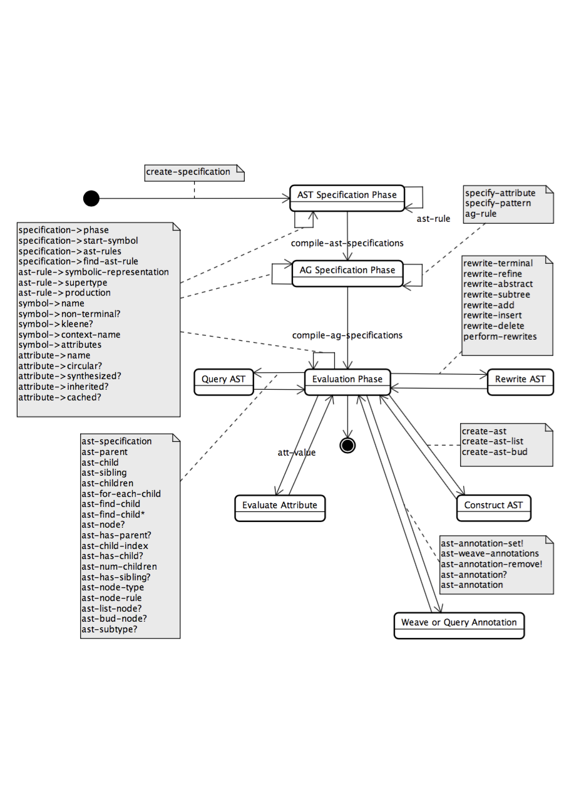
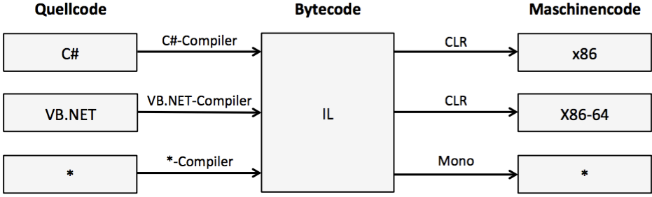

_[>> Title <<](title.md) [>> Preface <<](synopsis.md) [>> Contents <<](contents.md) [>> Bibliography <<](bibliography.md)_
___

# Konzeptionelle und technische Voraussetzungen

Die Grundlagen von _RACR-NET_ lassen sich in zwei Kategorien scheiden: Übersetzerbaukonzepte zur Spezifikation formaler Sprachen und Generierung entsprechender Sprachprozessoren und Technikräume, welche zur Implementierung genutzt wurden. Die _RACR_ _Scheme_-Bibliothek setzt hierbei sowohl den konzeptionellen, als auch den technischen Rahmen fest: RAG-gesteuerte Graphersetzung und die Programmiersprache _Scheme_. Als Technikraum für eine objektorientierte Adaption _RACRs_ wurde _C#_ und somit das _.NET_-Framework gewählt.

## Überblick der RAG-gesteuerten Graphersetzung

Attributgrammatiken \[[Knuth1968](bibliography.md),[Knuth1971](bibliography.md),[Paakki1995](bibliography.md)\] sind eine wichtige Technik im Übersetzerbau \[[Lam2006](bibliography.md)\]. Attribute bilden ein Gleichungssystem zur deklarativen Spezifikation kontextsensitiver Analysen basierend auf einer kontextfreien Grammatik. Somit ermöglichen Attributgrammatiken die Spezifikation der Semantik kontextfreier Sprachen.

Schwächen zeigen Attributgrammatiken bei der Berechnung nichtlokaler, bedingter Relationen und aggregierter Attributwerte \[[Hoover1986](bibliography.md)\]. Zum Beispiel müssen für die Namensanalyse typischer Programmiersprachen, wie _C++_ oder _Java_, Informationen aus dem Syntaxbaum bezüglich der Deklarationen gesammelt und in den jeweiligen Attributen wiederholt zwischengespeichert werden. Diese Aggregat-Attribute können sehr komplex werden, was die Erweiterbarkeit der Grammatik erschwert – besonders für Sprachen mit komplizierten Sichtbarkeitsbereichen der Variablen, wie zum Beispiel objektorientierten Sprachen.

Referenzattributgrammatiken adressieren dieses Problem durch die Einführung von Referenzattributen – Attribute, deren Wert Referenzen auf beliebige Knoten innerhalb des Syntaxbaums sind \[[Hedin2000](bibliography.md)\]. Mittels Referenzattributen wird der Syntaxbaum gewissermaßen mit zusätzlichen Kannten versehen und zu einem Syntaxgraph erweitert. Über Referenzen können auf die Attribute entfernter Knoten zugegriffen werden. Auf diese Weise kann Information von einem Knoten zu einem anderen entfernten Knoten im Syntaxbaum direkt übertragen werden und muss nicht in komplexen Aggregat-Attributen gehalten werden.

Für effiziente inkrementelle Attributsauswertungen ist es entscheidend, dass Attribute nicht unnötig mehrfach berechnet werden \[[MaddoxIII1997](bibliography.md)\]. Um Mehrfachauswertungen zu vermeiden, bietet es sich an, einmal berechnete Attributwerte in einem Cache-Speicher zu halten. Veränderungen am abstrakten Syntaxbaum (AST) erfordern jedoch eine Neuberechnung jener Attribute, die direkt oder indirekt von der modifizierten Baumstruktur abhängen. Deshalb müssen gegebenenfalls die Attribut-Caches invalidiert werden. Inkrementelle Attributsauswertung wurde bislang nur für statische Auswertungsverfahren realisiert \[[Buerger2012](bibliography.md),[Soederberg2012](bibliography.md)\]. Referenzattributgrammatiken erfordern jedoch eine dynamische Auswertung, da die Abhängigkeiten von auf Referenzattributen basierenden Attributen statisch unbekannt sind. Die inkrementelle Auswertung von Referenzattributgrammatiken war ein bis vor kurzem ungelöstes Problem.

Am _Lehrstuhl Softwaretechnologie_ der _Technischen Universität Dresden_ wurde von Christoff Bürger ein technisches Verfahren namens Referenzattributgrammatik-gesteuerte Graphersetzung \[[Buerger2012](bibliography.md),[Buerger2015b](bibliography.md)\] entwickelt, das effiziente, inkrementelle Auswertung von Referenzattributen, sowie den Einsatz von Attributgrammatik-basierten Analysen zur Graphersetzungen ermöglicht. Attributsabhängigkeiten werden dynamisch während der Auswertung überwacht. Bei einer Graphtransformation werden lediglich die Caches der Attribute invalidiert, die von der Struktur des geänderten Teilbaumes abhängen. Entsprechend werden in weiteren Analysen nur diese Attribute neu berechnet.

## _Scheme_

_Scheme_ ist die Implementierungssprache von _RACR_. Sie ist dynamisch, vorwiegend funktional und bekannt für ihr elegantes, minimalistisches Design.

Es existieren viele Interpreter und Compiler für _Scheme_, die jedoch häufig von offiziellen Sprach-Standards abweichen. Deshalb wird _Scheme_ oft als Überbegriff für eine ganze Familie von Dialekten angesehen. Das [Scheme Steering Committee](http://www.r6rs.org/steering-committee/), ein aus drei Personen bestehendes Gremium, das den Standardisierungsprozess der Sprache übersieht, selbst bezeichnete _Scheme_ als die unportierbarste Sprache der Welt \[[Clinger2009](bibliography.md)\].

Die verschiedenen Versionen der Sprache werden Revised _n_ Report on the Algorithmic Language Scheme (RnRS) genannt. Der _R6RS_ \[[Sperber2009](bibliography.md)\] brachte grundlegende, [teils kontroverse Änderungen](http://www.r6rs.org/ratification/electorate.html) mit sich. Um den Anforderungen der modernen Softwareentwicklung gerecht zu werden, wurde ein geregeltes Modulsystem eingeführt und die Sprache mit Standardbibliotheken ausgestattet. Da die Bibliotheken Teil des Standards selbst sind, ist der _R6RS_ im Vergleich zu seinem Vorgänger sehr viel umfangreicher, was im Widerspruch zu der minimalistischen Philosophie der Sprache steht. Es finden sich nur wenige vollständig _R6RS_-konforme [_Scheme_-Implementierungen](http://www.r6rs.org/implementations.html).

Der aktuelle _R7RS_ \[[Shinn2013](bibliography.md)\] teilt _Scheme_ in zwei getrennte, zueinander kompatible Sprachen auf: eine kleine, pädagogische Sprache mit minimalistischem Charakter und eine moderne, zweckmäßige Programmiersprache zur Softwareentwicklung, die den _R6RS_ ersetzen soll. Die kleine Sprache umfasst die wichtigsten Features des _R6RS_, wie Record-Typen, ein Bibliothekssystem und Exceptions, verzichtet aber auf viele zusätzliche, umfangreiche Bibliothekteile des _R6RS_.

Die wichtigsten Spracheigenschaften _Schemes_ sind eine dynamische Typisierung, imperative Schreiboperationen, lexikalische Hüllen und First-Class-Prozeduren, automatische Speicherverwaltung und hygienische Makros. _Scheme_ zwingt Programmierern kein spezifisches Paradigma, wie zum Beispiel logische, funktionale oder objektorientierte Programmierung, auf.  Vielmehr ist _Scheme_ dank seines mächtigen Makrosystems und der schlichten, prägnanten Syntax eine programmierbare Programmiersprache. Gewünschte Sprachkonzepte und Abstraktionen werden in _Scheme_ selbst hineinprogrammiert.

Aufgrund der dynamischen Typisierung und der automatischen Speicherverwaltung _Schemes_, welche die Freigabe von dynamisch allozierten Speicherplatz erfordert, wenn dieser nicht mehr benötigt wird, stellen _Scheme_-Implementierungen meist eine eigene Laufzeitumgebung zur Programmausführung bereit (virtuelle Maschine). _Scheme_-Implementierungen tendiert daher eher zu einem Interpreter- statt Übersetzeransatz.

## Die _RACR_ _Scheme_-Bibliothek

_RACR_ \[[Buerger2012](bibliography.md)\] ist die Referenzimplementierung der RAG-gesteureten Graphersetzung. Hierbei handelt es sich um eine _R6RS_-konforme _Scheme_-Bibliothek, welche in dieser Arbeit in _C#_ integriert werden soll. Die in ihr enthaltenen Prozeduren lassen sich in folgende Bereiche aufgliedern:

 * Definition von abstrakten Syntaxbaum-Schemata mithilfe von Nichtterminal-Klassen, Kompositen, typisierten Kind-Elementen und Vererbung zwischen Nichtterminal-Klassen (erweiterte Backus-Naur-Form \[[Scowen1998](bibliography.md)\], basierend auf Vererbung zwischen Nichtterminalen \[[Hedin1989](bibliography.md)\])
 * Attribuierung der Nichtterminale unter Nutzung normaler _Scheme_-Prozeduren als Attributgleichungen
 * Erzeugung von Syntaxbäumen für eine bestimmte Sprachspezifikation
 * Baum-Traversierung und Abfrage von Attributen und Knoten-Informationen (Die hierfür von _RACR_ bereitgestellten Funktionen werden innerhalb von Attributgleichungen zur Berechnung derselben genutzt.)
 * Annotation von AST-Knoten
 * Graphersetzung

Eine _RACR_-Anwendung kann für gewöhnlich in zwei Teile gegliedert werden. Der erst Teil umfasst die Spezifikationsphase der Sprache, in welcher zuerst Grammatikregeln und danach Attribute definiert werden. Attributgleichungen werden von Prozeduren verkörpert, die den Attributwert für einen AST-Knoten errechnen. Bemerkenswerterweise geschieht die Sprachdefinition zur Programmlaufzeit, was die Generierung von Sprachen abhängig von Laufzeitinformationen erlaubt. Insbesondere wird keine Typ-Hierarchie über die Nichtterminale angelegt. Stattdessen bietet _RACR_ für Nichtterminale jedes Typs eine generische Schnittstelle. Attribute sind somit nicht an einen bestimmen Typ gekoppelt. Sie können an verteilten Stellen im Programm definiert werden. Attribute sind dynamische Inter-Typ-Deklarationen gemäß der aspektorientierten Programmierung \[[Avgustinov2008](bibliography.md)\], eine bewährte Technik für die Implementierung erweiterbarer Sprachprozessoren \[[Ekman2006](bibliography.md)\].

Nachdem die Sprache spezifiziert wurde, können ASTs instanziiert werden und Attribute von AST-Knoten ausgewertet werden. Die inkrementelle Attributsauswertung, der wichtigste Vorteil von _RACR_ gegenüber vielen anderen Referenzattributgrammatik-Werkzeugen, kommt bei Graphersetzungen und anschließenden Attributsauswertungen zum Tragen. Gleichzeitig profitiert die Graphersetzung von attributbasierten Analysen. Beispielsweise kann der Wert von Attributen eine Prozedur sein, welche Ersetzungsregel-Anwendungen kapselt. Attribute können also zur Ableitung von Ersetzungen genutzt werden. Ein Vorteil dieses Ansatzes ist, dass die Mustererkennung (das Subgraphisomophismus-Problem \[[Ullmann1976](bibliography.md)\]) der Graphersetzung in Attribute kodiert ist und damit ebenfalls inkrementell erfolgt.

Das in Abbildung 2.1 gezeigte Zustandsdiagramm stellt alle Prozeduren _RACRs_ in Beziehung.

**Abbildung 2.1:** _RACRs_ API \[[Buerger2012](bibliography.md)\]

## Das _.NET_-Framework und die _Common Language Infrastructure_

_.NET_ ist ein von _Microsoft_ entwickeltes Software-Framework und eine integrale Komponente des _Windows_-Betriebssystems. Für _.NET_ entwickelte Programme werden nicht direkt nach Machinencode, sondern nach Bytecode – der _Intermediate Language_ (IL) – übersetzt und laufen innerhalb eines virtuellen Ausführungssystems. Programmiersprachen, die nach IL kompilieren, werden _.NET-Sprachen_ genannt, wobei _C#_ und _Visual Basic .NET_ zu den wichtigsten Vertretern gehören. Der IL-Code wird in sogenannten Assemblies in Form von EXE-Dateien (Prozess-Assemblies) oder DLL-Dateien (Library-Assemblies) gespeichert.

Die stapelbasierende virtuelle Maschine (VM) von _.NET_ wird innerhalb der _Common Language Infrastructure_ (CLI) \[[ECMA2012](bibliography.md)\], einem internationalen Standard, definiert und bietet sprach-neutrale Features, wie zum Beispiel automatische Speicherbereinigung, Exceptions, Typsicherheit, Zugriff auf eine umfangreiche Klassenbibliothek und Just-in-Time-Kompilierung, wobei entsprechend der zu Grunde liegenden Rechnerarchitektur IL-Code bedarfsgesteuert zu nativem Code übersetzt wird. Neben der _Common Language Runtime_ (CLR), der _Microsoft_-Implementierung der CLI, existieren [_Portable.NET_](http://www.dotgnu.org/) und das [_Mono_-Projekt](http://www.mono-project.com/) als kompatible, quelloffene Alternativen.

**Abbildung 2.2:** Übersetzung von _.NET_-Sprachen nach Maschinencode

Abbildung 2.2 veranschaulicht die Kompillierungsprozesse, die der Ausführung eines _.NET_-Programms vorhergehen müssen. Alle _.NET_-Programme haben gleichen Bytecode, unabhängig von der Implementierungssprache oder der Zielarchitektur. Dies hat folgende wichtige Konsequenzen zur Folge:

 * _.NET_-Programme sind nicht architekturgebunden, sondern plattformunabhängig. Ein unter _Windows_ entwickeltes Programm kann nach der Kompilierung unter _Linux_ (mittels _Mono_) ausgeführt werden und umgekehrt.
 * _.NET_-Sprachen haben zueinander hohe Interoperabilität. Die CLI vereinheitlicht unter anderem Exception-Handling, den Aufbau von und Zugriff auf Klassenbibliotheken und die Interaktion zwischen allen Datentypen. Objektinstanzen können über Sprachgrenzen hinweg ausgetauscht werden.

## _IronScheme_

[_IronScheme_](http://ironscheme.codeplex.com/) ist eine quelloffene, weitgehend _R6RS_-konforme _Scheme_-Implementierung für die _.NET_ Software-Plattform. Sie umfasst einen eigenständigen, interaktiven Interpreter zur Ausführung von _Scheme_-Programmen und eine Klassenbibliothek, mittels welcher _IronScheme_ in andere _.NET_-Projekte eingebunden werden kann. Diese Klassenbibliothek erlaubt es, _.NET_–Strings (genauer gesagt handelt es sich um den Typ `System.String` – die Klasse `String` im Namensraum `System`) als _Scheme_-Ausdruck auszuwerten, analog zu der `Eval`-Funktion, wie sie in vielen dynamischen Sprachen zu finden ist. So wird während der Programmausführung aus dem _Scheme_-Code IL-Code generiert und dieser anschließend ausgeführt. _Scheme_-Bibliotheken können jedoch auch zu Assemblies vorkompiliert werden.

 _Scheme_	| _.NET_
----------------|-------------------------------
`fixnum`	| `System.Int32`
`flonum`	| `System.Double`
`boolean`	| `System.Boolean`
`string`	| `System.String`
`pair`		| `IronScheme.Runtime.Cons`
`'()`		| `null`
`hashtable`	| `System.Collections.Hashtable`
symbol		| `Microsoft.Scripting.SymbolId`
procedure	| `Ironscheme.Runtime.Callable`

**Tabelle 2.3:** _IronSchemes_ Abbildung von _Scheme_-Datentypen auf _.NET_-Datentypen

Viele wichtige Datentypen sind als Adapter für _.NET_-Datentypen realisiert, was die Interoperabilität von _IronScheme_ zu anderen _.NET_-Sprachen erhöht. Andere Datentypen implementieren spezielle Schnittstellen. Die für diese Arbeit relevanten _Scheme_-Typen und deren zugehörige _.NET_-Typen sind in Tabelle 2.3 aufgeführt.
