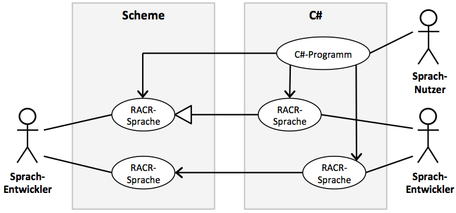

_[>> Title <<](title.md) [>> Preface <<](synopsis.md) [>> Contents <<](contents.md) [>> Bibliography <<](bibliography.md)_
___

# RACR-NET Implementierung: Prozedurale Schnittstelle

Dieses Kapitel beschäftigt sich mit der Umsetzung einer prozeduralen Schnittstelle, welche es ermöglicht, _RACR_ in _C#_ zu nutzen. Zuerst wird gezeigt, wie innerhalb von _C#_ _Scheme_-Code aufgerufen und wie die _RACR_-_Scheme_-Bibliothek effizient geladen werden kann. Nach einer Anforderungsanalyse wird die Implementierung vorgestellt. Die abschließende Evaluation zeigt die Schwächen einer rein prozeduralen Lösung und leitet zur finalen objektorientierten Lösung im folgenden Kapitel über.

## _Scheme_ in _C#_

Mittels der _IronScheme_-Klassenbibliothek kann _Scheme_-Code von _C#_ aus ausgeführt werden. _IronScheme_ bedient sich dazu der Extension-Methoden – ein Feature von _C#_, das es erlauben, einem existierenden Typen neue Methoden hinzuzufügen, ohne den ursprünglichen Typ zu manipulieren. Extension-Methoden sind spezielle statische Methoden, die vom Nutzer wie Instanz-Methoden aufgerufen werden.

_IronSchemes_ `Eval` ist eine solche Methode. Sie interpretiert _.NET_-Strings als _Scheme_-Ausdrücke und gibt einen Wert vom Typ `object` zurück, dem Basistypen aller _.NET_-Datentypen. Da _C#_ statisch typisiert ist, müssen Rückgabewerte zur sinnvollen Weiterverwendung üblicherweise explizit in einen Subtypen konvertiert werden. Deshalb bietet _IronScheme_ auch eine generische Variante der `Eval`-Methode. Diese akzeptiert einen Typ-Parameter, der den Typ des Rückgabewerts festlegt. Die Typumwandlung erfolgt hierbei innerhalb von `Eval`.

Bei Referenztypkonvertierungen wie dieser kann während der Code-Übersetzung nicht bestimmt werden, ob die Umwandlung gültig ist. Schlägt zur Laufzeit eine Typumwandlungsoperation fehl, wird eine `InvalidCastException` ausgelöst. Quelltext 3.1 veranschaulicht die Arbeitsweise von `Eval`.

```
object a = "(+ 1 2)".Eval();
int b = (int) a;					// explizite Umwandlung
bool c = "(< 3 4)".Eval<bool>();	// generische Methode

bool d = (bool) "(* 2 3)".Eval();	// Laufzeitfehler!
bool e = "(* 2 3)".Eval<bool>();	// Laufzeitfehler!
```
**Listing 3.1:** Auswerten von _Scheme_-Ausdrücken

Alle _Scheme_-Prozeduren implementieren das `Callable`-Interface, mittels welchem man eine Prozedur ohne mehrfaches Parsen oder Kompilieren wiederholt aufrufen kann. Diese abstrakte Klasse stellt `Call`-Methoden in verschiedenen Ausführungen bereit – variierend über die Anzahl von Parametern, welche wie auch der Rückgabewert stets vom Typ `object` sind. Auf diese Weise wird die dynamische Typisierung von _Scheme_ in _C#_ abgebildet. Beim Aufruf eines `Callable`-Objektes kann der Compiler für die korrekte Stelligkeit sowie die Typisierung der Parameter einer Prozedur nicht garantieren. Typfehler äußern sich erst während der Laufzeit eines Programms. Quelltext 3.2 zeigt das Interface in Aktion.

```
Callable sum = "+".Eval<Callable>();
int a = (int) sum.Call(1, 2);
int b = (int) sum.Call(3, 4, 5);
int c = (int) sum.Call(0, false);	// Laufzeitfehler!
```
**Listing 3.2:** Verwendung des `Callable`-Interfaces

## _RACR_ in _C#_

### Importieren von _Scheme_-Bibliotheken in _IronScheme_ und _R6RS_-Konformitätsprüfung

Der nächste Schritt besteht darin, _RACR_ dem _Scheme_-Environment bekannt zu machen. _RACR_ laden wir mittels `"(import (racr core))".Eval()`. Dieser Aufruf veranlasst _IronScheme_ dazu, den Quellcode _RACRs_, der in der Datei `racr/core.sls` residiert, zu kompilieren und alle darin als Export deklarierten Symbole zu registrieren. Dies geschieht mit jedem Neustart des _C#_-Programms, was dessen Anlaufzeit verlängert.

Ein weniger dokumentiertes Feature _IronSchemes_ erlaubt es, _Scheme_-Bibliotheken vorzukompilieren und in Assemblies zu speichern. Auf diese Weise kann das Laden von _RACR_ stark beschleunigt werden. Zum Beispiel lege man eine Datei namens `tmp.scm` mit dem Inhalt `(import (racr core))` an. Der Aufruf von `(compile "tmp.scm")` in der interaktiven _IronScheme_-Konsole generiert die Datei `racr.core.dll`. Wenn diese Assembly bei der Kompilierung eines _C#_-Programms referenziert wird, so kompiliert _IronScheme_ _RACR_ mit dem Aufruf von `import` nicht neu, sondern lädt den kompilierten Code aus der DLL-Datei. Um für alle _RACR_-Bibliotheken solche, von _IronScheme_ kompilierte und nutzbare, dynamic linked libraries zu generieren kann der mit _RACR_ ausgelieferter [Installationsskript](../../racr/documentation/requirements-and-installation.md) genutzt werden.

Wie im vorhergehenden Kapitel beschrieben, unterscheiden sich _Scheme_-Interpreter bezüglich ihrer _R6RS_-Konformität. Um die korrekte Funktion von _RACR_ unter Verwendung verschiedener Interpreter zu gewährleisten, beinhaltet _RACR_ eine reihe von Tests, die dessen wesentlichen Funktionsumfang abdecken. Diese Tests wurden mit _IronScheme_ ausgeführt und erfolgreich absolviert. Somit ist sichergestellt, dass _RACR_ unter _IronScheme_ korrekt ausgeführt wird.

**Anmerkung:** _In früheren_ IronScheme _Versionen unterstützte_ `equal-hashtable` _nicht die leere Liste_ `'()` _als Schlüssel. Diese_ R6RS-_Inkompatibilität ist seit commit_ [leppie/IronScheme@54e877f1d8f01691ecab95204bb7532e2a0d559a](https://github.com/leppie/IronScheme/commit/54e877f1d8f01691ecab95204bb7532e2a0d559a) _vom_ IronScheme-_Entwickler_ Llewellyn Pritchard _behoben._

## Anforderungsanalyse

Um die Qualität der _RACR_-_C#_-Schnittstelle bewerten zu können, müssen geeignete Kriterien festgelegt werden. Bislang steht dem Programmierer _RACR_ nur als _Scheme_-Bibliothek zur Verfügung. Folglich müssen sämtliche Aspekte einer Anwendung, die den Funktionsumfang von _RACR_ nutzen sollen, in _Scheme_ programmiert sein. Mit der Möglichkeit, _RACR_ auch in _C#_ nutzen zu können, ergeben sich neue Anwendungsfälle, in denen die verschiedenen Aspekte einer _RACR_-Anwendung zu variierenden Anteilen in _Scheme_ oder _C#_ implementiert sein können. In einem Beispiel-Szenario werden AST-Regeln und Attribute einer Sprachspezifikation in _Scheme_ definiert. Mittels dieser Spezifikation werden von _C#_ aus ASTs instanziiert und Analysen betrieben. Ein weiterer denkbarer Fall ist, dass eine in _Scheme_ spezifizierte Sprache in _C#_ um zusätzliche Attribute erweitert wird. Abbildung 3.1 visualisiert diese und weitere Szenarien. Es ergibt sich eine Vielzahl möglicher Varianten der Sprachnutzung, Kopplung und Vererbung und der Aufteilung deren Implementierungen in _Scheme_ und _C#_.



**Abbildung 3.1:** Anwendungsfälle von _RACR_ in _Scheme_ und _C#_

Diese Arbeit fokussiert sich auf das Szenario, in dem der Nutzer RACR ausschließlich von _C#_ aus bedient. Angesichts dessen werden folgende Anforderungen an das System gestellt:

 * **A1 – Vollständigkeit:** Alle dokumentierten \[[Buerger2012](bibliography.md)\] Funktionalitäten, die _RACR_ in _Scheme_ bietet, sollen uneingeschränkt auch von _C#_ aus nutzbar sein.
 * **A2 – Dynamik:** Die dynamische Natur _RACRs_ muss erhalten bleiben. Grammatik und Attribute sollen noch während der Programmlaufzeit festgelegt werden können. Dies schließt Code-Generatoren, die anhand einer Spezifikation _C#_-Code erzeugen, aus.
 * **A3 – Nähe zur originalen Schnittstelle:** Der Wechsel zwischen _Scheme_ und _C#_ soll für mit _RACR_ vertraute Programmierer intuitiv sein.
 * **A4 – Entkoppelung von _Scheme_:** Dass im Hintergrund die eigentliche Arbeit in einer _Scheme_-VM passiert, soll für _C#_-Nutzer irrelevant sein und sich in keinster Weise in der Schnittstelle widerspiegeln. Insbesondere sollen _IronScheme_-eigene Datentypen, wie zum Beispiel Paare, nicht in der Schnittstelle vorkommen. Stattdessen sollen äquivalente, _.NET_-typische Typen zum Einsatz kommen.

Im Nachfolgenden soll eine funktionierende, zunächst prozedurale Schnittstelle geschaffen werden, welche die Anforderungen **A1** bis **A4** erfüllt. Die endgültige objektorientierte Schnittstelle wird in Kapitel 4 behandelt.

## Implementierung der prozeduralen Schnittstelle

Die prozedurale Schnittstelle soll vollständig sein und die Funktionsweise _RACRs_ nicht einschränken. Ein naiver Ansatz zur Implementierung einer solchen Schnittstelle besteht darin, für jede _Scheme_-Prozedur in _C#_ ein direktes Gegenstück zu modellieren – in Form einer statischen Methode. Innerhalb dieser Methoden soll unter Verwendung der _IronScheme_-VM die entsprechende Prozedur aufgerufen werden. Auf diese Weise werden die Anforderungen **A1** und **A2** erfüllt.

Um Anforderung **A3** zu befriedigen, müssen die Methodennamen denen der zugehörigen Prozeduren gleichen. _RACR_ hält sich bei der Benennung von Variablen beziehungsweise Prozeduren an die für _Lisp_-Sprachen typischen Konventionen und verwendet in Bezeichnern einige Sonderzeichen. Beispielsweise werden innerhalb eines Bezeichners Worte durch Bindestriche getrennt. Bezeichner von Prozeduren, die einen booleschen Wert liefern, enden für gewöhnlich mit einem Fragezeichen. _C#_ hat seine eigenen Namenskonventionen. Sonderzeichen in Bezeichnern sind nicht gestattet. Alle Namen öffentlicher Member, Typen und Namespaces beginnen mit einem Großbuchstaben, Parameternamen jedoch mit einem Kleinbuchstaben. Beiderseits werden innerhalb eines Bezeichners verkettete Wörter durch Binnenmajuskel hervorgehoben.

Bei der Benennung der Methoden der _.NET_-Schnittstelle für _RACR_ soll die _C#_-übliche Namenskonvention eingehalten werden ohne den Prozedurnamen zu entfremden. Aus `create-ast` wird `CreateAst`. Alle anderen Benennungen geschehen analog. Somit wird die Realisierung von Anforderung **A3** gewährleistet. Quelltext 3.3 skizziert diesen Ansatz.

```
public static class Racr {
	private static Callable createSpecification;
	private static Callable astRule;
	// ...
	static Racr() {
		"(import (racr core))".Eval();
		createSpecification	= "create-specification".Eval<Callable>();
		astRule				= "ast-rule".Eval<Callable>();
		// ...
	}
	public static object CreateSpecification() {
		return createSpecification.Call();
	}
	public static void AstRule(object spec, string rule) {
		astRule.Call(spec, SymbolTable.StringToObject(rule));
	}
// ...
```
**Listing 3.3:** Prozedurale _C#_-Schnittstelle für _RACR_

Die statische Klasse `Racr` umfasst private `Callable`-Felder, die Referenzen auf die entsprechenden _Scheme_-Prozeduren _RACRs_ speichern sollen. Im statischen Konstruktor wird zuerst die _RACR_-Bibliothek geladen (Zeile 6), woraufhin alle `Callable`-Objekte initialisiert werden. Zusätzlich enthält die Klasse für jedes `Callable` eine statisch Methode, die als Adapter fungiert, indem sie ihre Argumente an die `Call`-Methode des entsprechenden `Callable`-Objekt durchreicht und dessen Rückgabewert zurückliefert. Ein triviales Beispiel hierfür ist die parameterlose Methode `CreateSpecification` (Zeile 11).

### Entkopplung von Scheme

Um die Anforderung **A4** zu erfüllen, werden gegebenenfalls Umwandlungen _Scheme_-eigener Datentypen erforderlich. _RACR_ nutzt Symbole, Paare und Listen – sowohl für Funktionsparameter als auch für Rückgabewerte. Des Weiteren erwarten einige Prozeduren als Argument selbst eine Prozedur. Der Umgang mit diesen _Scheme_-typischen Datentypen von _C#_ aus ist unbequem und ineffizient, weswegen sie in _RACRs_ _C#_-Schnittstelle vermieden werden sollen, sodass der Nutzer nicht mit ihnen konfrontiert wird. An ihrer statt sollen charakteristischere Typen zum Einsatz kommen. Die Implementierung der Schnittstelle muss für die Übersetzung solcher Typen Sorge tragen. Im Folgenden soll auf jene Datentypen eingegangen werden, die zur Verarbeitung in _C#_ einer Sonderbehandlung bedürfen.

#### Symbole

_Scheme_-Symbole tauchen in _RACRs_ Schnittstelle an vielen Stellen auf. Aufseiten von _C#_ sollen stattdessen _.NET_-Strings zum Einsatz kommen. Symbole werden unter anderem als Zeichenketten für Nichtterminale, ganze AST-Regeln und Attributsnamen verwendet. _IronScheme_ implementiert Symbole mittels der Struktur `SymbolId`, deren `ToString` Methode die String-Repräsentation der jeweiligen Symbol-Instanz liefert. Analog bildet die statische Methode `SymbolTable.StringToObject` Strings auf Symbole ab. Quelltext 3.3 zeigt die Verwendung von `SymbolTable.StringToObject` in der Methode `AstRule` (Zeile 15).

#### Paare

Paare sind in _Scheme_ ein essenzieller Datentyp. In _RACRs_ _Scheme_-Schnittstelle kommen Paare in folgenden Prozeduren zum Einsatz: `ast-children`, `ast-for-each-child`, `ast-find-child` und `ast-find-child*`. Diese Prozeduren verlangen neben anderen Arguenten eine unbestimmte Anzahl von sogenannten Kinder-Intervallen – Paare, die in Form von zwei Indices eine untere und ober Grenze enthalten. [Mit dem _Scheme_-Symbol `'*` kann auch eine offene obere Grenze angegeben werden](../../racr/documentation/abstract-syntax-trees.md#ast-children.md). Paare entsprechen in _C#_ Objekten der Klasse `Cons` aus der _IronScheme_-Klassenbibliothek. Nutzer sollen mit ihr nicht in Berührung kommen müssen, sondern zur Angaben von Kinder-Intervallen eine für genau diesen Zweck geschaffene Datenstruktur verwenden. Quelltext 3.5 zeigt die dafür konzipierte Struktur `Range`.

```
public struct Range {
	public int min;
	public int max;
	public Range(int min, int max=0) {
		this.min = min;
		this.max = max;
	}
	internal Cons ToCons() {
		return new Cons(min, max > 0 ? max : SymbolTable.StringToObject("*"));
	}
}
```
**Listing 3.4:** Definition der `Range`-Struktur

Zweckmäßig hält die Struktur zwei Felder für die beiden Grenzen, wobei eine obere Grenze mit dem Wert 0 als offen interpretiert wird (in _RACR_ werden Indices stets von 1 an gezählt). Die interne Methode `ToCons` dient dazu, aus dem `Range`- ein `Cons`-Objekt zu konstruieren, das von _IronScheme_ aus weiterverarbeitet werden kann. Sie kommt in den Methoden des Interfaces, welche die oben genannten Prozeduren abbilden sollen, zum Einsatz.

#### Listen

_Scheme_-Listen sind verschachtelte _Scheme_-Paare. Sie sind ein Parameter der Prozeduren `create-ast` und `create-ast-list` und der Rückgabetyp der Prozeduren `ast-children` und `rewrite-abstract`. Analog zu `create-ast-list`, erwartet die `create-ast` Prozedure als letztes Argument eine Liste mit den Kindern des zu erzeugenden AST-Knoten. In der _C#_-Schnittstelle soll für den Nutzer der Zwischenschritt, erst eine Liste für die Kinder zu konstruieren, übersprungen werden. Stattdessen soll die Methode `CreateAst` ein _C#_-Array von Kind-Knoten akzeptieren. Unter Verwendung einer einfachen Schleife über das Array soll daraus die _Scheme_-Liste erzeugt werden, damit sie anschließend beim Aufruf der _Scheme_-Prozedur übergeben werden kann.

```
public static object CreateAst(object spec, string nonTerm, params object[] children)
{
	Cons list = null;
	for (int i = children.Length - 1; i >= 0 ; i--) {
		list = new Cons(children[i], list);
	}
	return createAst.Call(spec, SymbolTable.StringToObject(nonTerm), list);
}
```
**Listing 3.5:** Listenkonstruktion in `CreateAst`

Quelltext 3.5 zeigt die Implementierung der Methode `CreateAst` der Klasse `Racr` gemäß den oben genannten Vorgaben. Man beachte, dass dem Parameter `children` das Schlüsselwort `params` vorangestellt ist. Es bewirkt, dass beim Aufruf der Methode eine variable Anzahl von Methodenargumenten automatisch zu einem Array zusammengefasst wird, sodass der Nutzer das Array nicht selbst anzulegen braucht. Will man beispielsweise einen Knoten mit drei Kind-Knoten erzeugen, gestaltet sich der Aufruf von `CreateAst` wie folgt:

```
object node = Racr.CreateAst(spec, "A", childA, childB, childC);
```

Auch als Rückgabewert sollen in der _C#_-Schnittstelle _Scheme_-Listen durch Arrays ersetzt werden. Die in Quelltext 3.6 abgebildete Implementierung von `RewriteAbstract` nutzt eine `while`-Schleife, um die Kette von `Cons`-Objekten zu durchwandern und die in der Liste gespeicherten Kind-Knoten einer `List<object>` anzuhängen. Die Klasse `List` ist Teil der _.NET_-Klassenbibliothek. Im Gegensatz zum Array bietet sie Methoden, um die Anzahl ihrer Elemente dynamisch zu ändern.

```
public object[] RewriteAbstract(string supertype) {
	var list = rewriteAbstract.Call(ast, SymbolTable.StringToObject(supertype)) as Cons;
	var children = new List<object>();
	while (list != null) {
		children.Add(list.car);
		list = list.cdr as Cons;
	}
	return children.ToArray();
}
```
**Listing 3.6:** Arraykonstruktion in `RewriteAbstract`

#### Prozeduren

_Schemes_ Prozeduren sind First-Class-Objekte und können Funktionen als Argumente überreicht werden. Insofern ist _Scheme_ eine höhere, funktionale Sprache. Wie schon erwähnt, sind Prozeduren aus der Sicht von _.NET_ Subtypen der abstrakten Klasse `Callable`. _C#_ unterstützt First-Class-Funktionen in Form von Delegaten – Referenztypen, mit denen eine benannte oder anonyme Methode gekapselt werden kann. Sie haben Ähnlichkeit mit Funktionszeigern in _C_. Der Typ eines Delegat-Objektes entspricht einer bestimmten Methodensignatur, die sich aus der Anzahl und den Typen der Parameter und dem Rückgabetyp zusammensetzt. Um _C#_-Methoden an _RACR_ zu übergeben, müssen diese zuerst in ein `Callable` umgewandelt werden. _IronScheme_ bietet zu diesem Zweck die Extension-Methode `ToSchemeProcedure` der Klasse `Delegate`, die Basisklasse aller Delegat-Typen. Innerhalb von _RACR_ erwarten folgende Prozeduren eine Funktion als Argument: `ast-for-each-child`, `ast-find-child`, `ast-find-child*` und `specify-attribute`. Dabei gleichen sich die ersten drei insofern, dass die Signatur der zu übergebenden Prozedur von _RACR_ vorgegeben ist, woraus sich für die _C#_-Schnittstelle ein entsprechender Delegat-Typ ergibt.

```
public static object AstFindChild(object node, Func<int,object,bool> f, params Range[] bs)
{
	object[] args = new object[2 + bs.Length];
	args[0] = f.ToSchemeProcedure();
	args[1] = node;
	for (int i = 0; i < bs.Length; i++) args[i + 2] = bs[i].ToCons();
	object res = astFindChild.Call(args);
	if (res is bool && (bool) res == false) return null;
	return res;
}
```
**Listing 3.7:** Delegat-Parameter in `AstFindChild`

Quelltext 3.7 zeigt die Implementierung von `AstFindChild`. Die Methode ist variadisch, genau wie die _Scheme_-Prozedur, an die sie ihre Argumente weiterleiten muss. Um eine unbestimmte Anzahl von Argumenten an den Aufruf eines `Callable`-Objekts weiterzugeben, müssen diese in ein Objekt-Array geschrieben werden, welches als einziger Parameter an `Call` übergeben werden muss. Zeile 3 deklariert dieses Array und die drei darauffolgenden Zeilen befüllen es. Dem Delegat-Typen `Func<int,object,bool>` zufolge muss die zu übergebende Funktion zwei Parameter mit den Typen `int` und `object` für den Index des Knoten beziehungsweise den Knoten selbst habe, nebst dem Rückgabetypen `bool`. `ToSchemeProcedure` nutzt die durch Introspektion zugänglichen Typinformationen, um ein `Callable`-Objekt zu generieren, in welchem der Delegat gekapselt wird. Die Methode `AstFindChild` weicht in ihrem Verhalten von `ast-find-child` ab, indem sie bei einer missglückten Suche statt `false` `null` zurückgibt (Zeile 8). Dies entspricht der in _C#_ üblichen Weise, das Fehlen eines Objektes zu kennzeichnen.

Der Aufruf von `AstFindChild` gestaltet sich unter Benutzung von _C#_'s Lambda-Ausdrücken elegant. Hier ein Beispiel:

```
object child = Racr.AstFindChild(parent, (i, n) => {
		bool success;
		// setze success anhand von Attributsauswertungen, etc.
		return success;
	}, new Racr.Range(2, 7));
```

Mit `specify-attribute` lassen sich (gegebenenfalls Referenz-) Attribute definieren. Dieser Prozedur muss dabei unter anderem eine Attributgleichung (in Form eines Delegaten) übergeben werden. _RACR_ unterstützt parametrisierte Attribute, was sich darin äußert, dass die Attributgleichungsfunktion neben einem Argument für den AST-Knoten noch weitere Argumente akzeptiert, mit welchem die auszuwertende Instanz des Attributes assoziiert ist. Bei der Attributsauswertung mittels `att-value` muss die entsprechende Anzahl an Argumenten des Attributs mit übergeben werden. Für die Korrektheit der Argumenttypen ist stets der Programmierer allein verantwortlich.

Aus der Sicht einer statisch typisierten Sprache wie _C#_ stellt diese Dynamik in der Attributsspezifikation und -auswertung eine Herausforderung dar, da der exakte Typ der Attributgleichungsfunktion beinahe beliebig sein kann: Nur der erste Parameter wird von _RACR_ als AST-Knote vorgegeben. Die Implementierung der Methodengruppe `SpecifyAttribute` ist in Quelltext 3.9 abgebildet (der Einfachheit halber ist hier eine Implementierung gezeigt, die keine zyklischen Attribute unterstützt). Die erste Methode besitzt für die Attributgleichung einen Parameter vom Typ `Delegate`. Lambda-Ausdrücke werden vom Compiler jedoch nicht implizit nach `Delegate` umgewandelt. Um den Nutzer dennoch von verbosen Typumwandlungen zu entlasten, decken die zwei zusätzlichen generischen Ausführungen von `SpecifyAttribute` den Fall für parameterlose (`Func<object,R>`) beziehungsweise mit einem Parameter parametrisierte (`Func<object,T,R>`) Attribute ab.

```
public static void SpecifyAttribute(object spec, string name,
		string nonTerm, string context, bool cached, Delegate eq)
{
	specifyAttribute.Call(spec,
		  SymbolTable.StringToObject(name),
		  SymbolTable.StringToObject(nonTerm),
		  SymbolTable.StringToObject(context),
		  cached,
		  eq.ToSchemeProcedure(),
		  false);
}
public static void SpecifyAttribute<R>(object spec, string name,
		string nonTerm, string context, bool cached, Func<object,R> eq)
{
	SpecifyAttribute(spec, name, nonTerm, context, cached, (Delegate) eq);
}
public static void SpecifyAttribute<T,R>(object spec, string name,
		string nonTerm,	string context, bool cached, Func<object,T,R> eq)
{
	SpecifyAttribute(spec, name, nonTerm, context, cached, (Delegate) eq);
}
```
**Listing 3.8:** Methodengruppe `SpecifyAttribute`

Um den Einsatz von `SpecifyAttribute` vorzuführen, definiert folgender _C#_-Code das parameterlose Attribut `value` für den Knotentypen `Addition`:

```
Racr.SpecifyAttribute(spec, "Eval", "Addition", "*", true, (n) => {
	return (int) Racr.AttValue(Racr.AstChild(n, 1), "value")
		 + (int) Racr.AttValue(Racr.AstChild(n, 2), "value");
});
```

Dies entspricht folgender Attributspezifikation in _Scheme_:

```
(with-specification spec
  (ag-rule
    value
    (Addition
      (lambda (n)
        (+ (att-value 'value (ast-child 1 n))
           (att-value 'value (ast-child 2 n)))))))
```
### Evaluation der Schnittstelle

Die resultierende Schnittstelle deckt den vollständigen Funktionsumfang _RACRs_ ab (**A1**). Sprachspezifikationen können zur Programmlaufzeit dynamisch definiert werden (**A2**). Obschon die Schnittstelle sehr dem Original ähnelt (**A3**), wird der Nutzer zu keiner Zeit mit konkreten _Scheme_-Typen konfrontiert (**A4**).

Die Schnittstelle hat jedoch zwei entscheidende Schwächen: Für Sprachspezifikationen und AST-Knoten fehlen konkrete Typen. Die entsprechenden _RACR_-spezifischen Objekttypen, auf denen alle _RACR_-Prozeduren arbeiten, sind _Scheme_-Records mit den Namen `ast-specification` beziehungsweise `node`. Diese Datentypen werden erst zur Programmlaufzeit generiert. _IronScheme_ kann für Instanzen solcher Typen keinen präziseren Subtypen als `object` geben. Effektiv handelt es sich hierbei um opake Handler, ähnliche den `void`–Zeigern in _C_. Deshalb sind Spezifikationen sowie AST-Knoten in der Schnittstelle stets als `object` typisiert. Konsequenterweise ist aus der Signatur einer _RACR_-Methode allein nicht klar ersichtlich, welcher tatsächliche Objekttyp erwartet wird, was eine Quelle von Typfehlern darstellt, die während der Übersetzung nicht erkannt werden können.

Eine weitere Schwachstelle besteht in der Benutzerfreundlichkeit der Schnittstelle, die dem Nutzer einen prozeduralen Programmierstil aufdrängt. Objektorientierung, die Grundcharakteristik von _C#_, wird nicht wirkungsvoll eingesetzt.

Aus den vorgestellten Nachteilen ergeben sich die folgenden zusätzlichen Anforderungen an die bereits in Kapitel 3.3 präsentierten:

 * **A5 – Entkoppelung von der _RACR_-Implementierung:** Der Nutzer soll nicht direkt mit den Handlern für `ast-specification` und `node` arbeiten. Opake _RACR_-Datentypen sollen in Stellvertreter-Objekten gekapselt werden.	
 * **A6 – Objektorientierung:** Alle wesentlichen Prozeduren von _RACR_ können entweder Spezifikationen oder AST-Knoten zugeordnet werden. Die _C#_-Schnittstelle soll diese Prozeduren als Methoden der entsprechenden Objekte bereitstellen.
