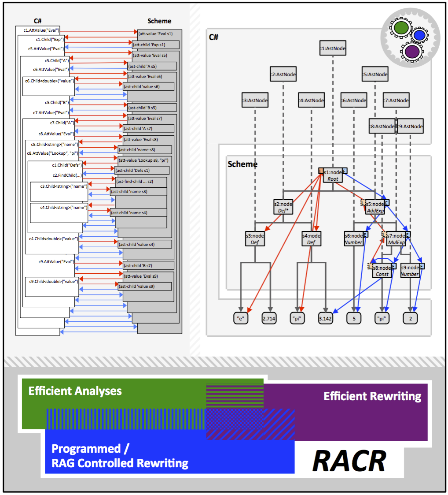

_[>> Title <<](title.md) [>> Preface <<](synopsis.md) [>> Contents <<](contents.md) [>> Bibliography <<](bibliography.md)_
___

# _RACR-NET_ Reference Manual

#### The _RACR_ C# Interface: Overview, Application and Implementation

**Author:** Daniel Langner (`s8572327@gmail.com`) **Editor:** Christoff Bürger (`christoff.buerger@gmail.com`)
