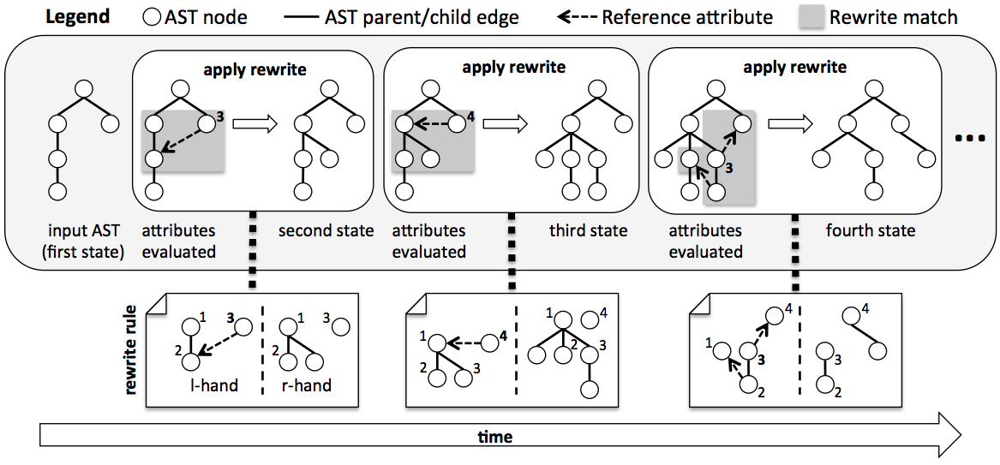
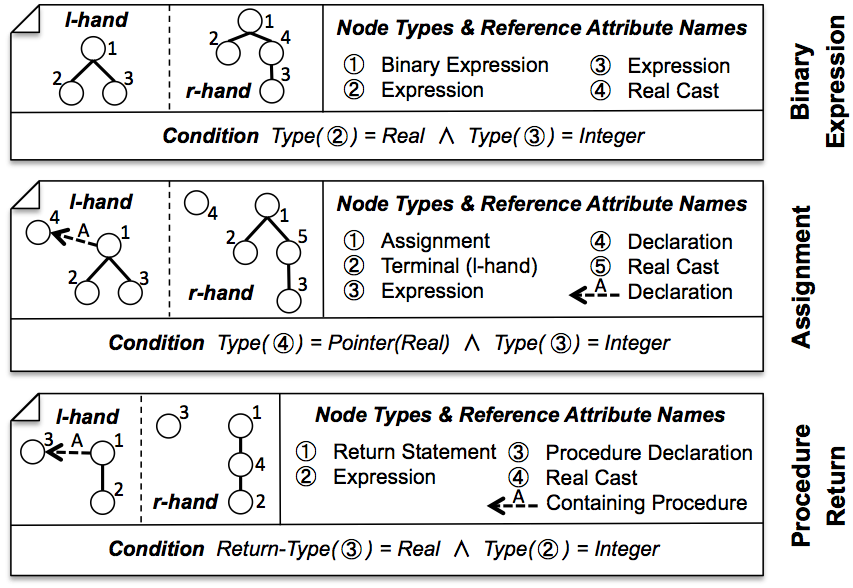

_[>> Title <<](title.md) [>> Synopsis <<](synopsis.md) [>> Contents <<](contents.md) [>> API Index <<](api-index.md)_
___

# Introduction

_RACR_ is a reference attribute grammar library for the programming language _Scheme_ supporting incremental attribute evaluation in the presence of abstract syntax tree (AST) rewrites. It provides a set of functions that can be used to specify AST schemes and their attribution and construct respective ASTs, query their attributes and node information and annotate and rewrite them. Three main characteristics distinguish _RACR_ from other attribute grammar and term rewriting tools:

  * **Library Approach** Attribute grammar specifications, applications and AST rewrites can be embedded into ordinary _Scheme_ programs; Attribute equations can be implemented using arbitrary _Scheme_ code; AST and attribute queries can depend on runtime information permitting dynamic AST and attribute dispatches.
  * **Incremental Evaluation based on Dynamic Attribute Dependencies** Attribute evaluation is demand-driven and incremental, incorporating the actual execution paths selected at runtime for control-flows within attribute equations.
  * **Reference Attribute Grammar Controlled Rewriting** AST rewrites can depend on attributes and automatically mark the attributes they influence for reevaluation.

Combined, these characteristics permit the expressive and elegant specification of highly flexible but still efficient language processors. The reference attribute grammar facilities can be used to realise complicated analyses, e.g., name, type, control- or data-flow analysis. The rewrite facilities can be used to realise transformations typically performed on the results of such analyses like code generation, optimisation or refinement. Thereby, both, reference attribute grammars and rewriting, are seamlessly integrated, such that rewrites can reuse attributes (in particular the rewrites to apply can be selected and derived using attributes and therefore depend on and are controlled by attributes) and attribute values change depending on performed rewrites. Figure 1.1 illustrates this analyse-synthesize cycle that is at the heart of reference attribute grammar controlled rewriting.



**Figure 1.1:** Analyse-Synthesize Cycle of RAG Controlled Rewriting

In the rest of the introduction we discuss why reference attribute grammar controlled rewriting is indeed expressive, elegant and efficient and why _RACR_ additionally is flexible and reliable. A short overview of [_RACR's_ features](introduction.md#racr-features) concludes the introduction.

## _RACR_ is Expressive, Elegant, Efficient, Flexible and Reliable

**Expressive** The specification of language processors using _RACR_ is convenient, because reference attribute grammars and rewriting are well-known techniques for the specification of static semantic analyses and code transformations. Further, reference attributes extend ASTs to graphs by introducing additional edges connecting remote AST nodes. The reference attributes induce an overlay graph on top of the AST. Since _RACR_ rewrites can be applied depending on attribute values, including the special case of dependencies on reference attributes, users can match arbitrary graphs and not only term structures for rewriting. Moreover, attributes can be used to realise complex analyses for graph matching and rewrite application (i.e., to control rewriting).

**Example:** _Figure 1.2 presents a set of rewrite rules realising a typical compiler construction task: The implicit coercion of integer typed expressions to real. Many statically typed programming languages permit the provision of integer values in places where real values are expected for which reason their compilers must automatically insert real casts that preserve the type correctness of programs. The RACR rewrite rules given in Figure 1.2 specify such coercions for three common cases: (1) Binary expressions, where the first operand is a real and the second an integer value, (2) the assignment of an integer value to a variable of type real and (3) returning an integer value as result of a procedure that is declared to return real values. In all three cases, a real cast must be inserted before the expression of type integer. Note, that the actual transformation (i.e., the insertion of a real cast before an expression) is trivial. The tricky part is to decide for every expression, if it must be casted. The specification of respective rewrite conditions is straightforward however, if name and type analysis can be reused like in our reference attribute grammar controlled rewriting solution. In the binary expression case (1), just the types of the two operands have to be constrained. In case of assignments (2), the name analysis can be used to find the declaration of the assignment's left-hand. Based on the declaration, just its type and the type of the assignment's right-hand expression have to be constrained. In case of procedure returns (3), an inherited reference attribute can be used to distribute to every statement the innermost procedure declaration it is part of. The actual rewrite condition then just has to constraint the return type of the innermost procedure declaration of the return statement and the type of its expression. Note, how the name analyses required in cases (2) and (3) naturally correspond to reference edges within left-hand sides of rewrite rules. Also note, that rewrites can only transform AST fragments. The specification of references within right-hand sides of rewrite rules is not permitted._



**Figure 1.2:** Rewrite Rules for Integer to Real Type Coercion of a Programming Language

**Elegant** Even if only ASTs can be rewritten, the analyse synthesise cycle ensures, that attributes influenced by rewrites are automatically reevaluated by the attribute grammar which specifies them, including the special case of reference attributes. Thus, the overlay graph is automatically transformed by AST rewrites whereby these transformations are consistent with existing language semantics (the existing reference attribute grammar). In consequence, developers can focus on the actual AST transformations and are exempt from maintaining semantic information throughout rewriting. The reimplementation of semantic analyses in rewrites, which is often paralleled by cumbersome techniques like blocking or marker nodes and edges, can be avoided.

**Example:** _Assume the name analysis of a programming language is implemented using reference attributes and we like to develop a code transformation which reuses existing or introduces new variables. In RACR it is sufficient to apply rewrites that just add the new or reused variables and their respective declarations if necessary; the name resolution edges of the variables will be transparently added by the existing name analysis._

A very nice consequence of reference attribute grammar controlled rewriting is, that rewriting benefits from any attribute grammar improvements, including additional or improved attribute specifications or evaluation time optimisations.

**Efficient Rewriting** To combine reference attribute grammars and rewriting to reference attribute grammar controlled rewriting is also reasonable considering rewrite performance. The main complexity issue of rewriting is to decide for a rewrite rule if and where it can be applied on a given graph (matching problem). In general, matching is NP-complete for arbitrary rules and graphs and polynomial if rules have a finite left-hand size. In reference attribute grammar controlled rewriting, matching performance can be improved by exploiting the AST and overlay graph structure induced by the reference attribute grammar. It is well-known from mathematics, that for finite, directed, ordered, labeled tress, like ASTs, matching is linear. Starting from mapping an arbitrary node of the left-hand side on an arbitrary node of the host graph, the decision, whether the rest of the left-hand also matches or not, requires no backtracking; It can be performed in constant time (the pattern size). Likewise, there is no need for backtracking to match reference attributes, because every AST node has at most one reference attribute of a certain name and every reference attribute points to exactly one (other) AST node. The only remaining source for backtracking are left-hand sides with several unconnected AST fragments, where, even if some fragment has been matched, still several different alternatives have to be tested for the remaining ones. If we restrict, that left-hand sides must have a distinguished node from which all other nodes are reachable (with non-directed AST child/parent edges and directed reference edges), also this source for backtracking is eliminated, such that under the assumption that all involved reference attributes are already evaluated, matching is linear (to be precise, the test if the rest of a pattern matches after mapping its distinguished node to some node of a host graph is constant and to find all matches of a pattern in a host graph is linear). In other words, the problem of efficient matching is reduced to the problem of efficient attribute evaluation.

**Efficient Attribute Evaluation** A common technique to improve attribute evaluation efficiency is the caching of evaluated attribute instances. If several attribute instances depend on the value of a certain instance `a`, it is sufficient to evaluate `a` only once, memorise the result and reuse it for the evaluation of the depending instances. In case of reference attribute grammar controlled rewriting however, caching is complicated because of the analyse-synthesise cycle. Two main issues arise if attributes are queried in-between AST transformations: First, rewrites only depend on certain attribute instances for which reason it is disproportionate to use (static) attribute evaluation strategies that evaluate all instances; Second, rewrites can change AST information contributing to the value of cached attribute instances for which reason the respective caches must be flushed after their application. In _RACR_, the former is solved by using a demand-driven evaluation strategy that only evaluates the attribute instances required to decide matching, and the latter by tracking dependencies throughout attribute evaluation, such that it can be decided which attribute instances applied rewrites influenced and incremental attribute evaluation can be achieved. In combination, demand-driven, incremental attribute evaluation enables attribute caching -- and therefore efficient attribute evaluation -- for reference attribute grammar controlled rewriting. Moreover, because dependencies are tracked throughout attribute evaluation, the actual execution paths selected at runtime for control-flows within attribute equations can be incorporated. In the end, the demand-driven evaluator of _RACR_ uses runtime information to construct an AST specific dynamic attribute dependency graph that permits more precise attribute cache flushing than a static dependency analysis.

**Example:** _Let_`att-value`_be a function, that given the name of an attribute and an AST node evaluates the respective attribute instance at the given node. Let_`n1`_,...,_`n4`_be arbitrary AST nodes, each with an attribute instance_`i1`_,...,_`i4`_named_`a1`_,...,_`a4`_respectively. Assume, the equation of the attribute instance_`i1`_for_`a1`_at_`n1`_is:_

```
(if (att-value a2 n2)
    (att-value a3 n3)
    (att-value a4 n4))
```

_Obviously,_`i1`_always depends on_`i2`_, but only on either,_`i3`_or_`i4`_. On which of both depends on the actual value of_`i2`_, i.e., the execution path selected at runtime for the_`if`_control-flow statement. If some rewrite changes an AST information that influences the value of_`i4`_, the cache of_`i1`_only has to be flushed if the value of_`i2`_was_`#f`_._

Besides automatic caching, a major strong point of attribute grammars, compared to other declarative formalisms for semantic analyses, always has been their easy adaptation for present programming techniques. Although attribute grammars are declarative, their attribute equation concept based on semantic functions provides sufficient opportunities for tailoring and fine tuning. In particular developers can optimise the efficiency of attribute evaluation by varying attributions and semantic function implementations. _RACR_ even improves in that direction. Because of its tight integration with _Scheme_ in the form of a library, developers are more encouraged to _"just program"_ efficient semantic functions. They benefit from both, the freedom and efficiency of a real programming language and the more abstract attribute grammar concepts. Moreover, _RACR_ uses _Scheme's_ advanced macro- and meta-programming facilities to still retain the attribute evaluation efficiency that is rather typical for compilation- than for library-based approaches.

**Flexible** _RACR_ is a _Scheme_ library. Its AST, attribute and rewrite facilities are ordinary functions or macros. Their application can be controlled by complex _Scheme_ programs that compute, or are used within, attribute specifications and rewrites. In particular, _RACR_ specifications themselves can be derived using _RACR_. Different language processors developed using _RACR_ can interact with each other without limitations and any need for explicit modeling of such interactions. Moreover, all library functions are parameterised with an actual application context. The function for querying attribute values uses a name and node argument to dispatch for a certain attribute instance and the functions to query AST information or perform rewrites expect node arguments designating the nodes to query or rewrite respectively. Since such contexts can be computed using attributes and AST information, dynamic -- i.e., input dependent -- AST and attribute dispatches within attribute equations and rewrite applications are possible. For example, the name and node arguments of an attribute query within some attribute equation can be the values of other attributes or even terminal nodes. In the end, _RACR's_ library approach and support for dynamic AST and attribute dispatches eases the development and combination of language product lines, metacompilers and highly adaptive language processors.

**Reliable** _RACR_ specified language processors that interact with each other to realise a stacked metaarchitecture consisting of several levels of language abstraction can become very complicated. Also dynamic attribute dispatches or user developed _Scheme_ programs applying _RACR_ can result in complex attribute and rewrite interactions. Nevertheless, _RACR_ ensures that only valid specifications and transformations are performed and never outdated attribute values are used, no matter of application context, macros and continuations. In case of incomplete or inconsistent specifications, unspecified AST or attribute queries or transformations yielding invalid ASTs, _RACR_ throws appropriate runtime exceptions to indicate program errors. In case of transformations influencing an AST information that has been used to evaluate some attribute instance, the caches of the instance and all instances depending on it are automatically flushed, such that they are reevaluated if queried later on. The required bookkeeping is transparently performed and cannot be bypassed or disturbed by user code (in particular ASTs can only be queried and manipulated using library functions provided by _RACR_). There is only one restriction developers have to pay attention for: To ensure declarative attribute specifications, attribute equations must be side effect free. If equations only depend on attributes, attribute parameters and AST information and changes of stateful terminal values are always performed by respective terminal value rewrites, this restriction is satisfied.

## _RACR_ Features

Abstract Syntax Trees (AST):
  * Typed non-terminals
  * _EBNF_ (Kleene closure & list-nodes)
  * Non-terminal inheritance
  * AST fragments (incomplete ASTs containing special non-terminal markers called bud-nodes which designate places where proper subtrees still have to be provided)
  * AST annotations (weaving of arbitrary entities into ASTs)

Attribute Grammars:
  * Synthesised and inherited attributes
  * Circular attributes
  * Reference attributes
  * Parameterised attributes
  * Attribute broadcasting
  * Attribute inheritance & shadowing
  * Automatic attribute caching & demand-driven, incremental attribute evaluation

Graph Patterns:
  * Patterns consisting of arbitrary many AST fragments and connecting reference edges
  * Reuse attributes to specify complex rewrite conditions
  * Linear matching complexity
  * Automatic caching & demand-driven, incremental evaluation of pattern matching

AST Rewrites:
  * Subtree and terminal replacement
  * Non-terminal refinement and abstraction
  * Insertion, deletion and addition of list elements
  * Deconstruction, refinement and reuse of AST fragments via bud-node replacement
  * Automatic attribute dependency and cache maintenance in the presence of rewrites

[_C#_ Integration](../../racr-net/documentation/title.md) based on [IronScheme](https://ironscheme.codeplex.com):
  * Use _RACR_ in _C#_/_.NET_
  * No opaque _Scheme_ types or values; just _C#_
  * Use _C#_ to specify attributes, their equations and rewrites
  * Take advantage of _RACR's_ incremental evaluation, and other features, in _C#_

## Structure of the Manual

The next [chapter](requirements-and-installation.md) presents requirements and the installation of _RACR_. [Chapter 3](architecture.md) gives an overview about the general architecture of _RACR_, i.e., its embedding into _Scheme_, its library functions and their usage. Chapters 4-8 then present the library functions in detail: [Chapter 4](abstract-syntax-trees.md) the functions for the specification, construction and querying of ASTs; [Chapter 5](attribution.md) the functions for the specification and querying of attributes; [Chapter 6](rewriting.md) the functions for rewriting ASTs; [Chapter 7](ast-annotations.md) the functions for associating and querying entities associated with AST nodes (so called AST annotations); and finally [Chapter 8](support-api.md) the functions that ease development for common cases like the configuration of a default _RACR_ language processor. The following appendix presents _RACR's_ complete implementation. The implementation is well documented. All algorithms, including attribute evaluation, dependency graph maintenance and the attribute cache flushing of rewrites, are stepwise commented and therefore provide a good foundation for readers interested into the details of reference attribute grammar controlled rewriting. Finally, an [API index](api-index.md) eases the lookup of library functions within the manual.
