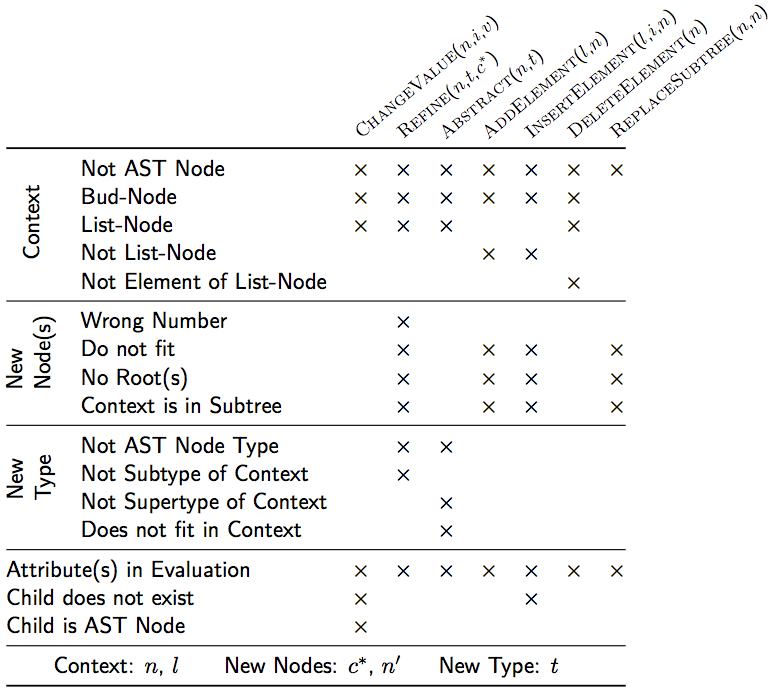

_[>> Title <<](title.md) [>> Synopsis <<](synopsis.md) [>> Contents <<](contents.md) [>> API Index <<](api-index.md)_
___

# Rewriting

A very common compiler construction task is to incrementally change the structure of ASTs and evaluate some of their attributes in-between. Typical examples are interactive editors with static semantic analyses, code optimisations or incremental AST transformations. In such scenarios, some means to rewrite (partially) evaluated ASTs, without discarding already evaluated and still valid attribute values, is required. On the other hand, the caches of evaluated attributes, whose value can change because of an AST manipulation, must be flushed. Attribute grammar systems supporting such a behaviour are called incremental. _RACR_ supports incremental attribute evaluation in the form of rewrite functions. The rewrite functions of _RACR_ provide an advanced and convenient interface to perform complex AST manipulations and ensure optimal incremental attribute evaluation (i.e., rewrites only flush the caches of the attributes they influence).

Of course, rewrite functions can be arbitrary applied within complex _Scheme_ programs. In particular, attribute values can be used to compute the rewrites to apply, e.g., rewrites may be only applied for certain program execution paths with the respective control-flow depending on attribute values. However, _RACR_ does not permit rewrites throughout the evaluation of an attribute associated with the rewritten AST. The reason for this restriction is, that rewrites within attribute equations can easily yield unexpected results, because the final AST resulting after evaluating all attributes queried can depend on the order of queries (e.g., the order in which a user accesses attributes for their value). By prohibiting rewrites during attribute evaluation, _RACR_ protects users before non-confluent behaviour.

Additionally, _RACR_ ensures, that rewrites always yield valid ASTs. It is not permitted to insert an AST fragment into a context expecting a fragment of different type or to insert a single AST fragment into several different ASTs, into several places within the same AST or into its own subtree using rewrites. In case of violation, the respective rewrite throws a runtime exception. The reason for this restrictions are, that attribute grammars are not defined for arbitrary graphs but only for trees.

Figure 5.1 summarises the conditions under which _RACR's_ rewrite functions throw runtime exceptions. Marks denote exception cases. E.g., applications of `rewrite-add` whereat the context `l` is not a list-node are not permitted. Rewrite exceptions are thrown at runtime, because in general it is impossible to check for proper rewriting using source code analyses. _Scheme_ is Turing complete and ASTs, rewrite applications and their arguments can be computed by arbitrary _Scheme_ programs.



**Figure 5.1:** Runtime Exceptions of _RACR's_ Primitive Rewrite Functions

## Primitive Rewrite Functions

### `rewrite-terminal`

```
(rewrite-terminal c/i n new-value)
```

Given a node `n`, a child name or index `c/i` and an arbitrary value `new-value`, change the value of `n`'s `c/i` child (in case `c/i` is an index, `n`'s `c/i`'th child), which must be a terminal, to `new-value`. Thereby, the caches of any influenced attributes are flushed and dependencies are maintained. An exception is thrown, if `n` has no `c/i` child (no `c/i`'th child in case `c/i` is an index), the child is no terminal or any attributes of the AST `n` is part of are in evaluation. If rewriting succeeds, the old/rewritten value of the terminal is returned.

**Note:** _`rewrite-terminal` does not compare the old and new value for equivalence. If they are equal, the rewrite is still performed such that the caches of depending attributes are flushed. Developers are responsible to avoid such unnecessary rewrites._

### `rewrite-refine`

```
(rewrite-refine n t . c)
```

Given a node `n` of arbitrary type, a non-terminal type `t`, which is a subtype of `n`'s current type, and arbitrary many non-terminal nodes and terminal values `c`, rewrite the type of `n` to `t` and add `c` as children for the additional contexts `t` introduces compared to `n`'s current type. Thereby, the caches of any influenced attributes are flushed and dependencies are maintained. An exception is thrown, if `t` is no subtype of `n`, not enough or to much additional context children are given, any of the additional context children does not fit, any attributes of the AST `n` is part of or of any of the ASTs spaned by the additional children are in evaluation, any of the additional children already is part of another AST or `n` is within the AST of any of the additional children.

**Note:** _Since list, bud and terminal nodes have no type, they cannot be refined._

```
(let* ((spec (create-specification))
       (A
        (with-specification
         spec
         (ast-rule 'S->A)
         (ast-rule 'A->a)
         (ast-rule 'Aa:A->b-A-c)
         (compile-ast-specifications 'S)
         (compile-ag-specifications)
         (ast-child 'A
                    (create-ast
                     'S
                     (list
                      (create-ast 'A (list 1))))))))
  (assert (= (ast-num-children A) 1))
  (assert (eq? (ast-node-type A) 'A))
  ; Refine an A node to an Aa node. Note, that Aa nodes have three
  ; additional child contexts beside the one they inherit:
  (rewrite-refine A 'Aa 2 (create-ast spec 'A (list 42)) 3)
  (assert (= (ast-num-children A) 4))
  (assert (eq? (ast-node-type A) 'Aa))
  (assert (= (- (ast-child 'c A) (ast-child 'a A)) (ast-child 'b A)))
  (assert (= (* 14 (ast-child 'c A)) (ast-child 'a (ast-child 'A A)))))
```

### `rewrite-abstract`

```
(rewrite-abstract n t)
```

Given a node `n` of arbitrary type and a non-terminal type `t`, which is a supertype of `n`'s current type, rewrite the type of `n` to `t`. Superfluous children of `n` representing child contexts not known anymore by `n`'s new type `t` are deleted. Further, the caches of all influenced attributes are flushed and dependencies are maintained. An exception is thrown, if `t` is not a supertype of `n`'s current type, `t` does not fit w.r.t. the context in which `n` is or any attributes of the AST `n` is part of are in evaluation. If rewriting succeeds, a list containing the deleted superfluous children in their original order is returned.

**Note:** _Since list-, bud- and terminal nodes have no type, they cannot be abstracted._

```
(let* ((spec (create-specification))
       (A
        (with-specification
         spec
         (ast-rule 'S->A)
         (ast-rule 'A->a)
         (ast-rule 'Aa:A->b-A-c)
         (compile-ast-specifications 'S)
         (compile-ag-specifications)
         (ast-child 'A
                    (create-ast
                     'S
                     (list
                      (create-ast 'Aa (list 1 2 (create-ast-bud) 3))))))))
  (assert (= (ast-num-children A) 4))
  (assert (eq? (ast-node-type A) 'Aa))
  ; Abstract an Aa node to an A node. Note, that A nodes have three
  ; less child contexts than Aa nodes:
  (rewrite-abstract A 'A)
  (assert (= (ast-num-children A) 1))
  (assert (eq? (ast-node-type A) 'A)))
```

### `rewrite-subtree`

```
(rewrite-subtree old-fragment new-fragment)
```

Given an AST node to replace (`old-fragment`) and its replacement (`new-fragment`) replace `old-fragment` by `new-fragment`. Thereby, the caches of any influenced attributes are flushed and dependencies are maintained. An exception is thrown, if  `new-fragment` does not fit, `old-fragment` is not part of an AST (i.e., has no parent node), any attributes of either fragment are in evaluation, `new-fragment` already is part of another AST or `old-fragment` is within the AST spaned by `new-fragment`. If rewriting succeeds, the removed `old-fragment` is returned.

**Note:** _Besides ordinary node replacement also list-node replacement is supported. In case of a list-node replacement_ `rewrite-subtree` _checks, that the elements of the replacement list `new-fragment` fit w.r.t. their new context._

### `rewrite-add`

```
(rewrite-add l e)
```

Given a list-node `l` and another node `e` add `e` to `l`'s list of children (i.e., `e` becomes an element of `l`). Thereby, the caches of any influenced attributes are flushed and dependencies are maintained. An exception is thrown, if `l` is not a list-node, `e` does not fit w.r.t. `l`'s context, any attributes of either `l` or `e` are in evaluation, `e` already is part of another AST or `l` is within the AST spaned by `e`.

### `rewrite-insert`

```
(rewrite-insert l i e)
```

Given a list-node `l`, a child index `i` and an AST node `e`, insert `e` as `i`'th element into `l`. Thereby, the caches of any influenced attributes are flushed and dependencies are maintained. An exception is thrown, if `l` is no list-node, `e` does not fit w.r.t. `l`'s context, `l` has not enough elements, such that no `i`'th position exists, any attributes of either `l` or `e` are in evaluation, `e` already is part of another AST or `l` is within the AST spaned by `e`.

### `rewrite-delete`

```
(rewrite-delete n)
```

Given a node `n`, which is element of a list-node (i.e., its parent node is a list-node), delete it within the list. Thereby, the caches of any influenced attributes are flushed and dependencies are maintained. An exception is thrown, if `n` is no list-node element or any attributes of the AST it is part of are in evaluation. If rewriting succeeds, the deleted list element `n` is returned.

## Rewrite Strategies

### `perform-rewrites`

```
(perform-rewrites n strategy . transformers)
```

Given an AST node `n`, part of some AST fragment G called work graph, a strategy for traversing G and a set of transformers, apply the transformers on the nodes of G visited by the given strategy until no further transformations are possible (i.e., a normal form is established). Each transformer is a function with a single parameter which is the node currently visited by the strategy. The visit strategy applies the transformers one by one on the currently visited node until either, one matches (i.e., performs a rewrite) or all fail. Thereby, each transformer decides, if it performs any rewrite for the currently visited node. If it does, it performs the rewrite and returns a truth value equal to `#t`, otherwise `#f`. If all transformers failed (i.e., non performed any rewrite), the visit strategy selects the next node of G to visit. If there are no further nodes to visit (i.e., all nodes to visit have been visited and no transformer performed any rewrite) `perform-rewrites` terminates. If any transformer performed a rewrite, the visit strategy starts from scratch, i.e., the AST fragment resulting after the just performed rewrite becomes the new work graph G' and the visit strategy is initialised to the state it would have if `perform-rewrites` has just been applied on G' with the given transformers.

`Perform-rewrites` supports two general visit strategies, both deduced from term rewriting: (1) outermost (leftmost redex) and (2) innermost (rightmost redex) rewriting. In terms of ASTs, outermost rewriting prefers to rewrite the node closest to the root (top-down rewriting), whereas innermost rewriting only rewrites nodes when there does not exist any applicable rewrite within their subtree (bottom-up rewriting). In case several topmost or bottommost rewritable nodes exist, the leftmost is preferred in both approaches. The strategies can be selected by using `'top-down` and `'bottom-up` respectively as strategy argument.

An exception is thrown by `perform-rewrites`, if at any time a transformer performs a rewrite that inserts the work graph G into another AST. Exceptions are also thrown, if the given transformers are not functions of arity one or do not accept an AST node as argument.

When terminating, `perform-rewrites` returns a list containing the respective result returned by each applied transformer in the order of their application (thus, the length of the list is the total number of executed transformers).

**Note:** _Transformers must realise their actual rewrites using primitive rewrite functions; They are responsible to ensure all constraints of applied primitive rewrite functions are satisfied since the rewrite functions throw exceptions as usual in case of any violation._

**Note:** _It is the responsibility of the developer to ensure, that transformers are properly implemented, i.e., they return `#f` if, and only if, they perform no rewrite and if they perform a rewrite the rewrite does not cause any exception. In particular, `perform-rewrites` has no control about performed rewrites for which reason it is possible to implement a transformer violating the intension of a rewrite strategy, e.g., a transformer traversing the AST on its own and thereby rewriting arbitrary parts._

**Note:** _To ease the development of transformers for patterns specified using `specify-pattern`, the `create-transformer-for-pattern` function can be used. It provides convenient means to associate a rewrite context defined by a pattern attribute (i.e., the l-hand of a rewrite rule) with a transformer (i.e., the r-hand of a rewrite rule). When doing so, `with-bindings` can be used to ease the specification of the actual transformer w.r.t. pattern bindings._

### `create-transformer-for-pattern`

```
(create-transformer-for-pattern spec node-type att-name rewrite-fun . args)
; spec: RACR specification
; node-type: Type of the pattern's distinguished node (Scheme symbol)
; att-name: Name of the pattern attribute (Scheme symbol)
; rewrite-fun: Function performing the actual rewrite
; args: Additional arguments for the pattern's condition and the rewrite function
```

Given a _RACR_ specification, a context describing a certain pattern attribute, an arbitrary function called rewrite function and additional attribute arguments, construct a proper transformer that can be argument for `perform-rewrites`. The constructed transformer returns `#f` if, and only if, either, its node argument does not have a non-broadcasted instance of the given pattern attribute or its respective instance applied to the given pattern arguments returns `#f`. Otherwise, the transformer applies the given rewrite function to the binding list returned by the pattern attribute and the given pattern arguments. If the result of this application is not `#f`, it is the result of the transformer; otherwise the transformer returns `#t`.

An exception is thrown, if the given pattern attribute is not defined considering the given _RACR_ specification or the given rewrite function's arity is not `|pattern-arguments| + 1`.

**Note:** _For the convenient specification of rewrite functions, `with-bindings` can be used to provide bindings for the pattern's named nodes. The actual rewrites have to be performed by primitive rewrite function applications within the rewrite function's body. The constraints of such primitive rewrites must be satisfied however, or exceptions are thrown as used to. It is the developers responsibility to ensure, that rewrite functions indeed perform any rewrites at all if applied. In particular, applied rewrite functions should manipulate the AST in such a way that their respective pattern attribute evaluates to `#f` at some point, otherwise `perform-rewrites` will not terminate._
