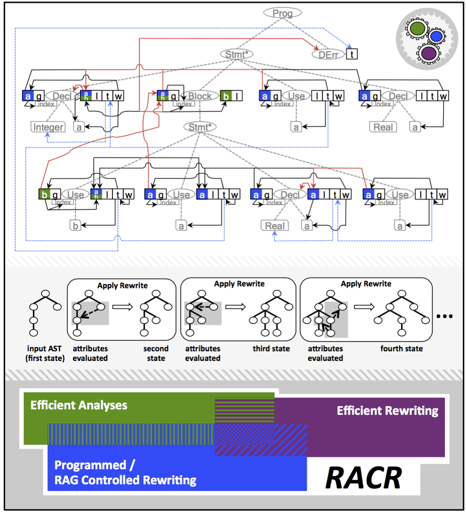

_[>> Title <<](title.md) [>> Synopsis <<](synopsis.md) [>> Contents <<](contents.md) [>> API Index <<](api-index.md)_
___

# _RACR_ Reference Manual

#### A _Scheme_ Library for Reference Attribute Grammar Controlled Rewriting

**Author:** Christoff Bürger (`christoff.buerger@gmail.com`)
